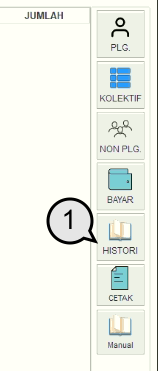
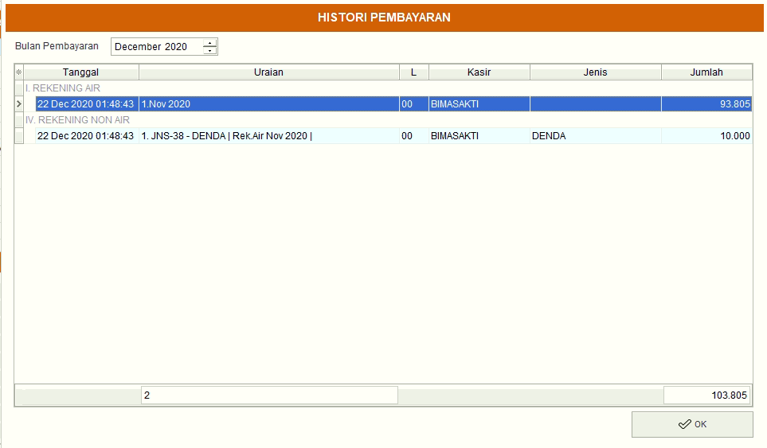
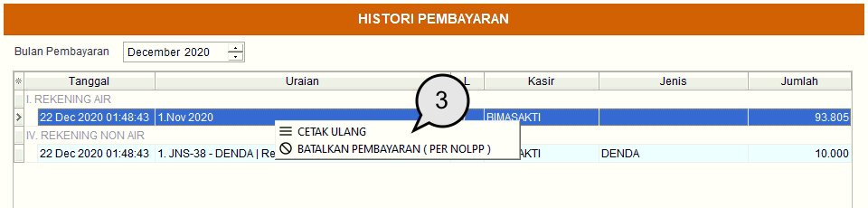
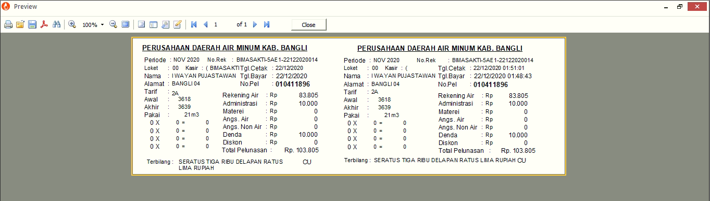
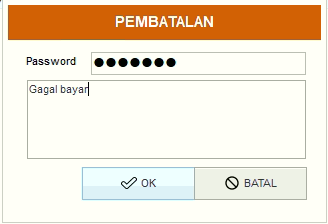

= Menampilkan Histori Tagihan

Setelah melakukan pembayaran anda dapat melihatnya pada fitur histori. Pada fitur ini terdapat 2 _action_ yang dapat anda gunakan yaitu cetak ulang kwitansi pembayaran dan pembatalan pembayaran.

1. Pilih menu *History* pada sidebar kanan
+

2. Setelah itu akan muncul tampilan histori pembayaran pelanggan.
+

3. Klik kanan untuk menampilkan action *Cetak Ulang kwitansi pembayaran* dan *Batalkan Pembayaran*.
4. Pilih action yang ingin anda lakukan.
+

5. Berikut merupakan tampilan untuk *cetak ulang* kwitansi pembayaran.
+

6. Untuk _action_ pembatalan pembayaran verifikasi dengan memasukkan _password_ dan alasan mengapa dibatalkan, lalu tekan *OK*.