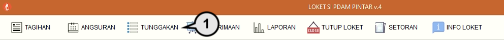
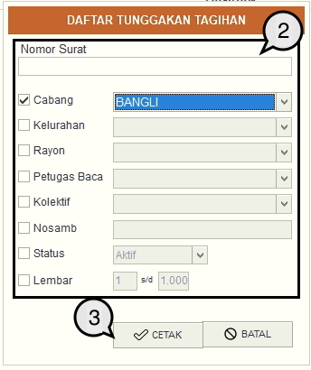
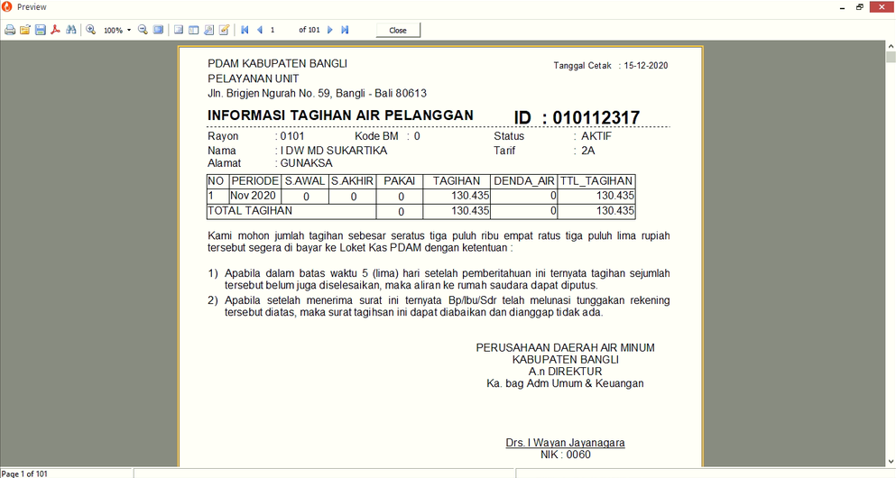

= Menampilkan Tunggakan Tagihan Pelanggan

Berikut ini adalah langkah-langkah untuk menampilkan laporan tunggakan pelanggan: 

1. Pilih menu *Tunggakan*
+

2. Pilih kategori data pelanggan yang ingin ditampilkan
3. Gunakan tombol *Cetak* untuk menampilkan data yang dibutuhkan
+

4. Selanjutnya akan muncul tampilan preview dari detail informasi tagihan seluruh pelanggan.