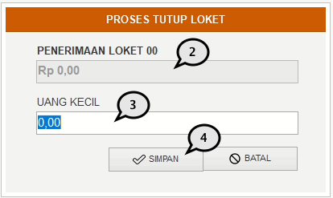

= Menutup Loket

Untuk melakukan penutupan pada loket per harinya, ikuti langkah-langkah berikut:

1. Pilih menu *Tutup Loket* pada _menu bar_. Sistem akan menampilkan _pop-up_ form.
+

2. Jumlah penerimaan transaksi harian akan secara otomatis di-_generate_ oleh sistem.
3. Isi jumlah uang kecil yang didapatkan dalam hari tersebut.
4. Klik pada tombol *Simpan*.