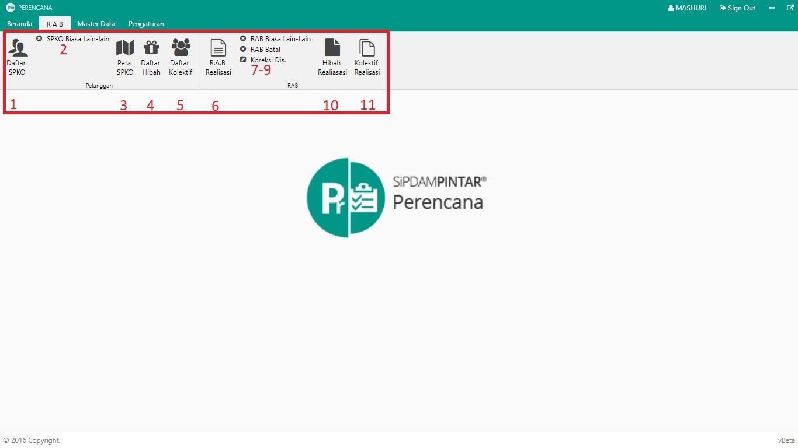
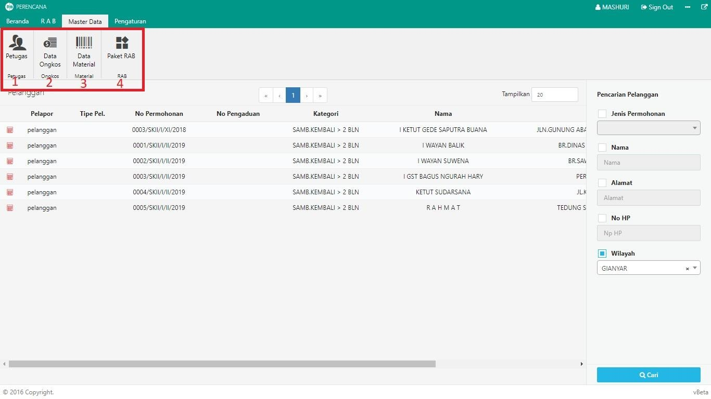
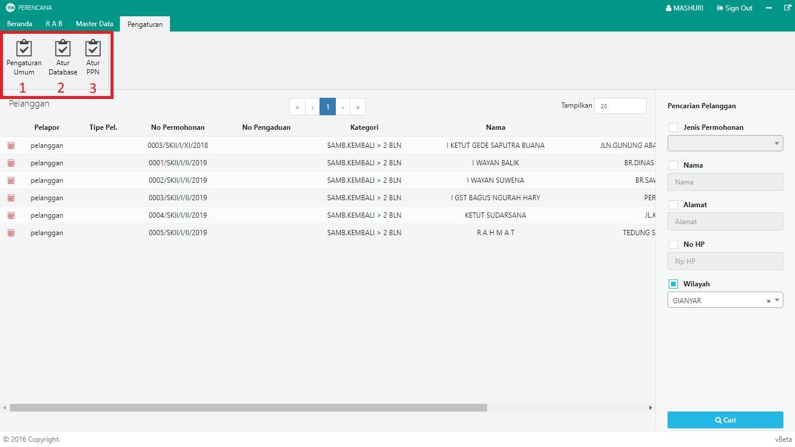

= Menu Modul Perencanaan (Web Version)

Modul Perencanaan (Web Version) memiliki tiga (3) menu utama, yaitu:

.*Menu RAB*
[%collapsible]
====

Berikut penjelasan ikon di setiap poin :

1. Ikon *Daftar SPKO* digunakan untuk menampilkan daftar SPKO (Surat Perintah Kerja Opname) yang siap untuk dibuatkan RAB (Rancangan Anggaran Biaya) dari pengaduan yang telah ditambahkan di bagian Hubungan Langganan.
2. Ikon *SPKO Biasa lain-lain* menyediakan surat penunjukan untuk pekerjaan pengaduan biasa lain-lain
Ikon *Peta SPKO* digunakan untuk menampilkan peta persebaran calon pelanggan yang siap untuk dibuatkan RAB. Peta ini membantu petugas perencanaan dalam melihat lokasi pelanggan sehingga dapat memperkirakan material yang akan digunakan di RAB.
3. Ikon *Daftar Hibah* menyediakan daftar pelanggan baru (Hibah) yang siap untuk dibuatkan RAB (Rancangan Anggaran Biaya) dari pengaduan yang telah ditambahkan di bagian Hubungan Langganan.
4. Ikon *Daftar Kolektif* menyediakan daftar pelanggan baru (Kolektif) yang siap untuk dibuatkan RAB (Rancangan Anggaran Biaya) dari pengaduan yang telah ditambahkan pada bagian Hubungan Langganan.
5. Ikon *RAB Realisasi* menampilkan daftar RAB Realisasi (RAB yang telah dibuat sebelumnya), yang dapat dilakukan edit dan cetak ulang RAB.
6. Ikon *RAB Biasa lain-lain* digunakan untuk membuat pengajuan RAB jika terdapat pengaduan yang memerlukan material/barang.
7. Ikon *RAB Batal* menampilkan daftar RAB yang dibatalkan karena alasan tertentu.
8. Ikon *Koreksi Distribusi* digunakan untuk koreksi RAB yang sudah masuk ke bagian distribusi jika ada kekurangan material.
9. Ikon *Hibah Realisasi* digunakan untuk menampilkan daftar RAB dari pelanggan HIBAH yang telah direalisasikan sebelumnya.
10. Ikon *Kolektif Realisasi* digunakan untuk menampilkan daftar RAB dari pelanggan KOLEKTIF yang telah direalisasikan sebelumnya
====

.*Menu Master Data*
[%collapsible]
====

1. Ikon *Petugas* digunakan untuk mengelola data petugas survey sekaligus sebagai user login di Modul Hubungan Langganan, Perencanaan, dan Distribusi. 
2. Ikon *Data Ongkos* digunakan untuk mengelola data ongkos kerja yang nantinya ditambahkan saat pembuatan RAB.
3. Ikon *Data Material* digunakan untuk mengelola data material yang nantinya ditambahkan saat pembuatan RAB.
4. Ikon *Paket RAB* digunakan untuk mengelola data Paket RAB. Satu paket RAB yang terdiri dari beberapa material.
====

.*Menu Pengaturan*
[%collapsible]
====

1. Ikon *Pengaturan Umum* digunakan untuk mengelola pengaturan umum dalam modul.
2. Ikon *Atur Database* digunakan untuk mengatur _host_, _username_, dan _password_ pada Modul Hubungan Langganan, Perencanaan, dan Distribusi.
3. Ikon *Atur PPN* digunakan untuk mengatur data PPN pada pembuatan RAB.
====