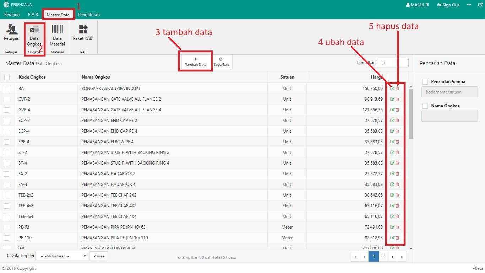
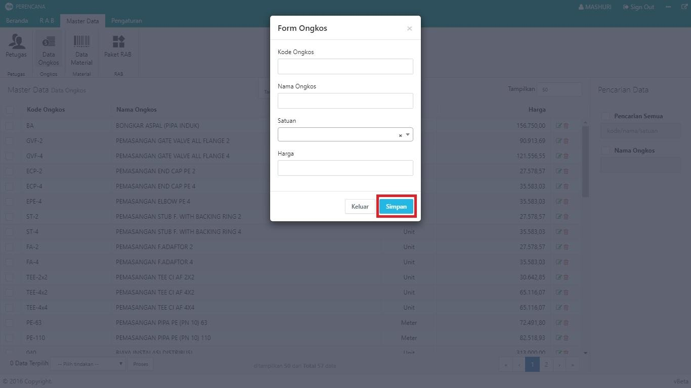
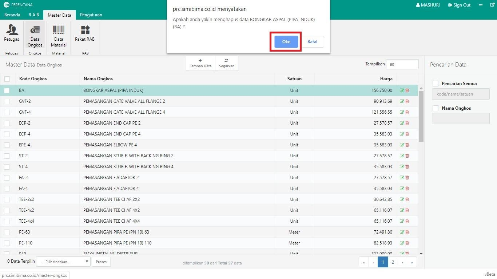

= Mengelola Data Ongkos Perbaikan

Dalam Modul Perencanaan, Anda dapat melakukan pengelolaan data ongkos perbaikan, seperti menambah, memperbarui dan menghapus data. Ikuti langkah-langkah berikut untuk mengelola data:

1. Pilih menu *Master Data*
2. Klik pada ikon *Data Ongkos*
3. Untuk menambah data ongkos, klik pada tombol *Tambah* seperti pada poin 3 pada gambar di atas. Selanjutnya, Anda akan diminta untuk memasukkan data sesuai yang tertera pada _form_. Jika semua data pada _form_ sudah terisi dengan benar, klik pada tombol *Simpan* seperti pada gambar di bawah ini: 
+

4. Untuk memperbarui data yang sebelumnya sudah pernah dibuat, klik pada ikon *memperbarui data* seperti poin 4 pada gambar utama diatas. Perbarui data sesuai kebutuhan, kemudian klik tombol *Simpan* seperti pada gambar di bawah ini:
+

5. Untuk menghapus data, klik pada ikon tombol *Hapus* seperti poin 5 pada gambar utama. Sistem akan menampilkan _pop up_ untuk mengkonfirmasi bahwa Anda yakin untuk menghapus data tersebut. Untuk menghapus data, klik pada tombol *Oke* seperti pada gambar di bawah ini:
+
