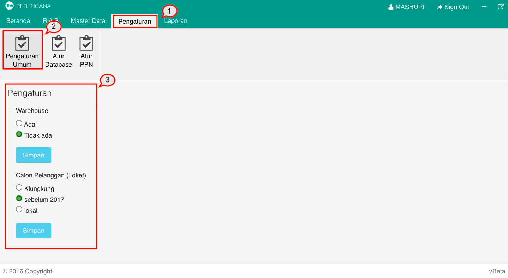

= Melakukan Pengaturan Umum

Dalam Modul Perencanaan, Anda dapat melakukan dua macam pengaturan umum, yaitu Warehouse dan calon pelanggan. Untuk melakukan pengaturan, ikuti langkah-langkah berikut:

1. Pilih menu *Pengaturan*
2. Cari ikon *Pengaturan Umum*
3. Ubah sesuai pengaturan *Warehouse* dan  *Calon Pelanggan (Loket)*. Setelah selesai, klik pada tombol *Simpan*.