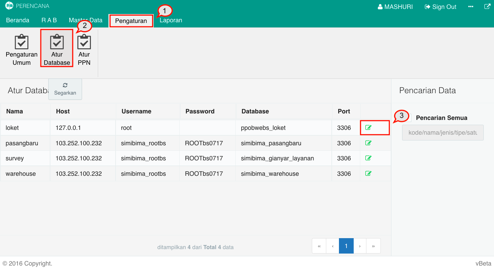
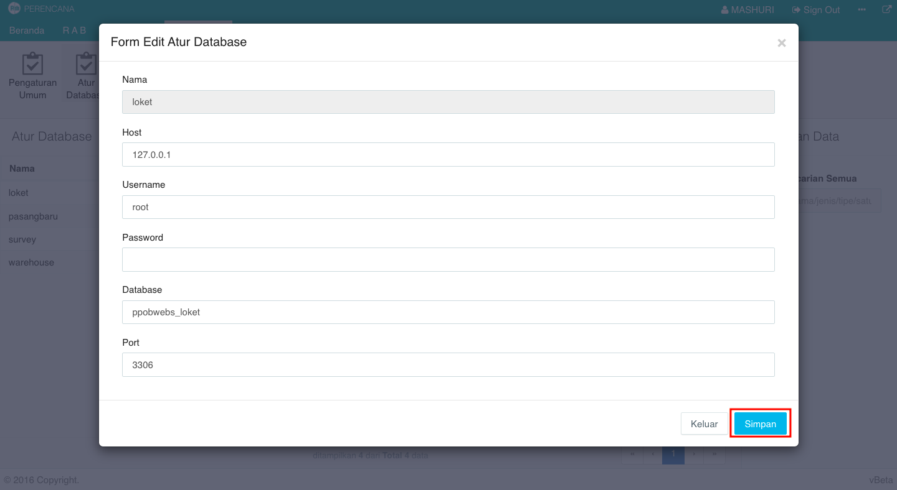

= Mengatur Database

Database yang digunakan dalam Modul Perencanaan dapat diatur dalam menu Pengaturan. Untuk mengaturnya, ikuti detail langkah berikut:

1. Pilih menu *Pengaturan*
2. Cari ikon *Atur Database*
3. Pilih data yang ingin diatur, kemudian klik pada ikon *Perbaiki Data*
+

4. Setelah itu, akan muncul _form_ *Edit Atur Database*. Ubah data sesuai yang diinginkan, kemudian klik tombol *Simpan*.