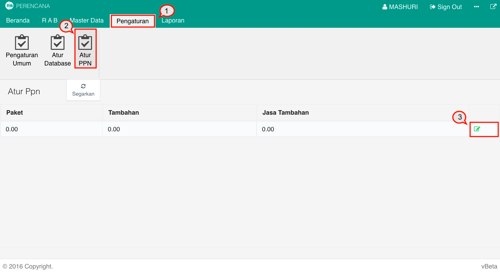
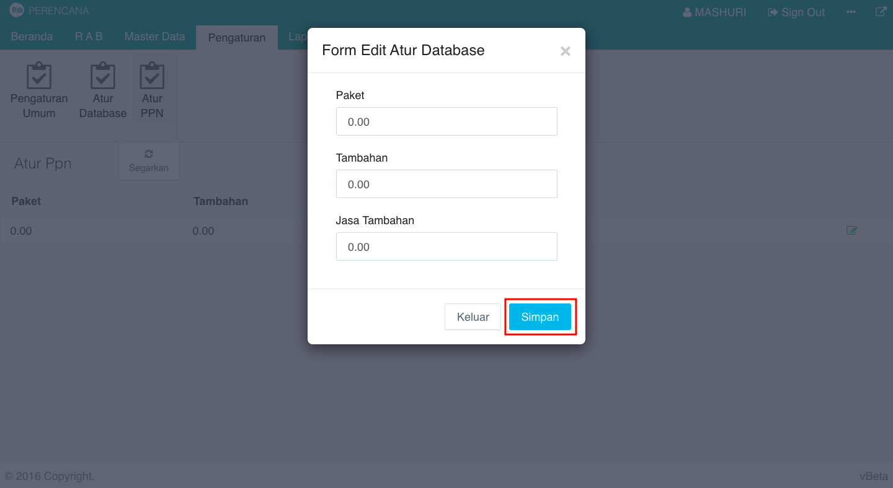

= Mengatur PPN

Untuk mengatur data PPN yang akan diterapkan dalam Modul Perencanaan, ikuti langkah-langkah di bawah ini:

1. Pilih menu *Pengaturan*
2. Cari ikon *Atur PPN*
3. Pilih data yang ingin diatur, kemudian klik pada ikon *Perbaiki Data*
+

4. Setelah itu akan muncul _form_ *Edit Atur Database* kemudian ubah data sesuai yang di inginkan. Setelah selesai klik tombol *Simpan*.