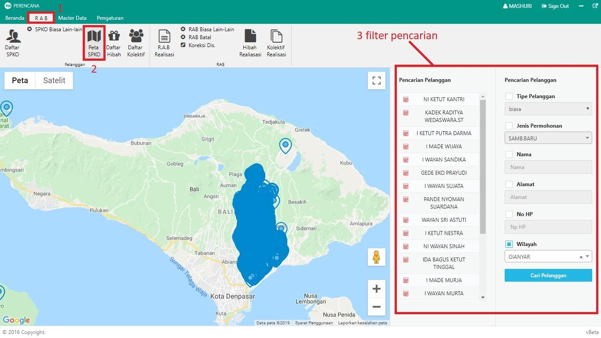

= Melihat Pemetaan Daftar SPKO

Dalam Modul Perencanaan, Anda dapat menampilkan daftar pengaduan yang sudah dipetakan berdasarkan lokasi sambungan yang diadukan. Ikuti langkah-langkah berikut untuk menampilkannya:

1. Pilih menu *RAB*
2. Klik ikon *Paket RAB*. Jika terdapat data pengaduan yang sudah tercatat pada bagian Hubungan Langganan, maka secara otomatis data akan ditampilkan seperti pada gambar di atas.
3. Untuk mempermudah pencarian data daftar SPKO tertentu, Anda dapat memanfaatkan *Filter Pencarian*. Dengan filter tersebut, Anda dapat menampilkan data berdasarkan tipe pelanggan, jenis permohonan, nama, alamat, no.hp maupun wilayah seperti pada poin 3 gambar di atas.