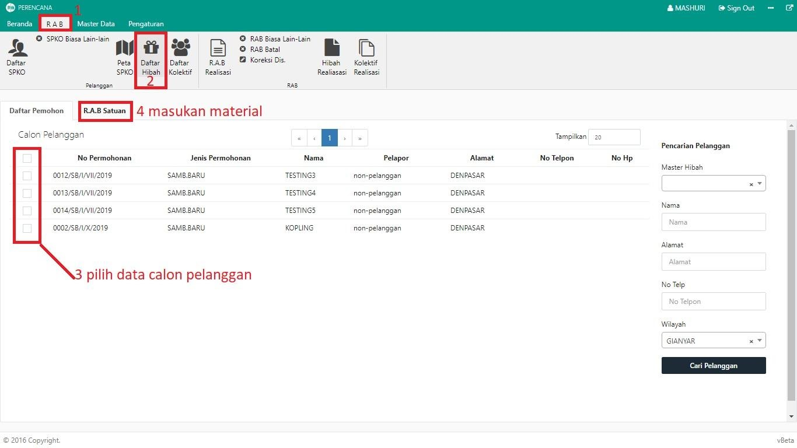
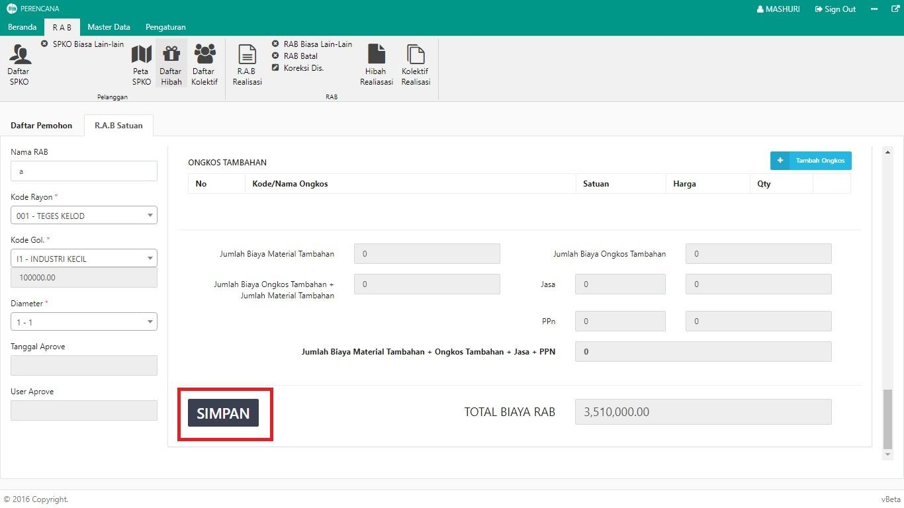

= Membuat RAB Hibah

Untuk melakukan pembuatan RAB Hibah, ikuti langkah-langkah berikut:

1. Pilih menu *RAB*
2. Klik pada ikon *Daftar Hibah*
3. Pilih calon pelanggan yang akan dibuatkan RAB. Anda dapat memilih lebih dari satu pelanggan.
4. Masukkan paket material yang digunakan pada RAB satuan. Jika semua material sudah dimasukan, klik pada tombol *Simpan* sebagaimana gambar di bawah ini:
+
