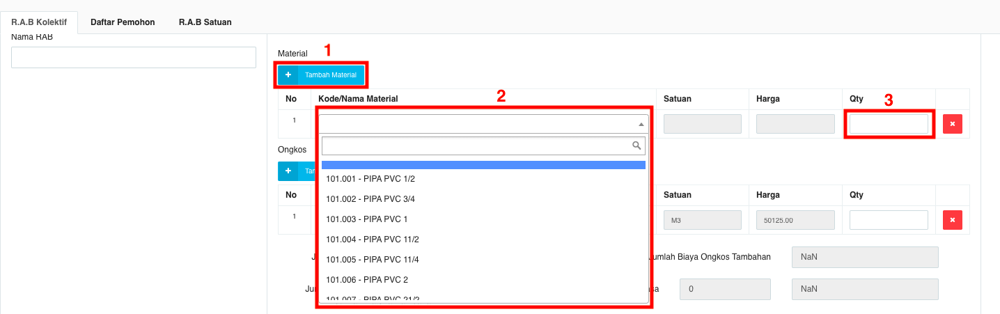

= Membuat RAB Kolektif 

Untuk membuat RAB kolektif, ikuti langkah-langkah berikut:

1. Pilih menu *RAB*
2. Klik pada ikon *Daftar Kolektif*
3. Pilih tab *RAB Kolektif* seperti pada poin 3 gambar di atas
4. Masukkan *Nama RAB* sesuai dengan RAB yang ingin dibuat
5. Untuk menambah material, klik tombol *Tambah Material* hingga muncul kolom untuk memasukkan No, Kode/Nama material, Satuan, Harga, dan Qty. Pilih *kode dan nama material* (poin 2) yang sesuai pada pilihan untuk menampilkan satuan dan harga, kemudian masukkan *jumlah* yang diinginkan pada kolom *Qty* yang ditunjukkan pada poin 3 gambar di bawah ini
+

6. Untuk menambah ongkos, klik tombol *Tambah Ongkos* hingga muncul kolom untuk memasukkan No, Kode/Nama ongkos, Satuan, Harga, dan Qty. Pilih *kode dan nama ongkos* (poin 3) yang sesuai pada pilihan yang tersedia untuk menampilkan satuan dan harga, kemudian masukkan *jumlah* yang diinginkan pada kolom *Qty* yang ditunjukkan pada poin 3 gambar di bawah ini
+

7. Sistem secara otomatis akan menampilkan biaya material sesuai dengan pilihan material, ongkos dan quantity yang dimasukkan sebelumnya dan total keseluruhan biaya RAB
+

8. Jika ingin *membatalkan* tambah material/ongkos, Anda dapat menekan tombol *batal (x)*  di samping kolom Qty
+

9. Pilih nama pemohon dengan cara masuk ke tab *Daftar Pemohon* seperti yang ditunjukkan poin 3 pada gambar di bawah ini. Kemudian pilih nama dengan cara menekan kotak pada *Nama* yang diinginkan seperti pada poin 4
+

10. Selanjutnya, masuk ke halaman *RAB Satuan* dengan cara menekan tab *RAB Satuan* seperti pada poin 3 gambar dibawah ini. Kemudian isikan *Nama RAB, Kode Rayon, Kode Golongan,* dan *Diameter* pada form yang tersedia seperti yang ditunjukkan pada poin 4 gambar di bawah ini
+

11. Kemudian isi form *RAB Standar* dan *RAB Lapangan* dengan memilih pilihan yang tersedia seperti pada gambar dibawah ini
+

12. Selanjutnya akan muncul paket material yang sesuai dengan *RAB Standar* dan *RAB Lapangan* yang dipilih
+

13. Untuk mengetahui detail biaya-biaya lainnya, Anda dapat menggeser kursor ke halaman bawah. Anda juga dapat melakukan *Tambah Material, Tambah Ongkos* dan *Reset*
+

14. Pada bagian halaman paling bawah, sistem akan menampilkan total biaya kolektif dan total biaya keseluruhan RAB. Klik tombol *Simpan* untuk menyimpan RAB kolektif yang dibuat.
+

15. Sistem akan menampilkan dokumen *Rencana Keperluan Perlengkapan* sesuai dengan data yang telah Anda masukkan sebelumnya.
+
