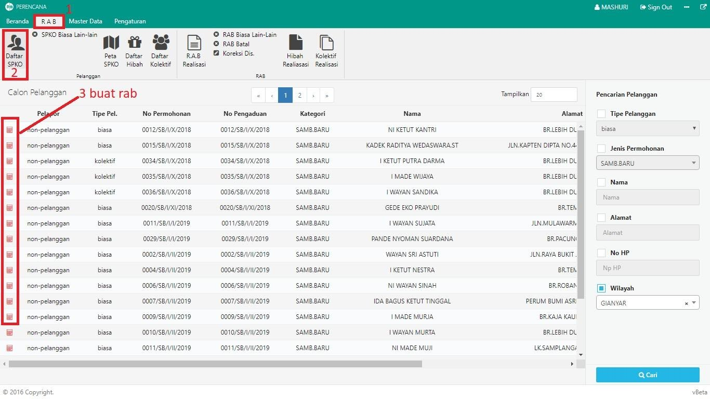

= Membuat RAB Sambungan Baru

Untuk membuat RAB sambungan baru, ikuti langkah-langah berikut:

1. Pilih menu *RAB*
2. Cari ikon *Daftar SPKO*. Jika terdapat data pengaduan sambungan baru yang dimasukkan melalui Modul Hubungan Langganan, maka data akan secara otomatis akan muncul
3. Pilih data yang akan dibuat RABnya dengan cara klik tombol ikon *RAB*, seperti poin 3 pada gambar diatas
4. Isi form data pelanggan, seperti pada gambar di bawah ini:
+

5. Masukan paket material yang digunakan pada tab *RINCIAN RAB*. Jika semua material sudah dimasukan, klik tombol *Simpan* sebagaimana gambar di bawah ini :
+
