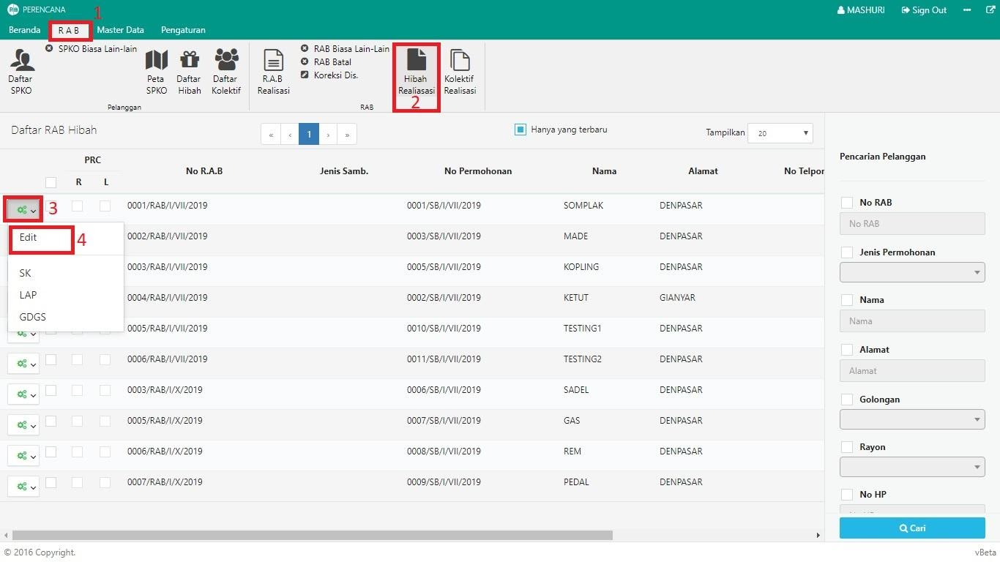

= Mengubah RAB Realisasi Hibah

Untuk mengubah RAB Realisasi Hibah, ikuti langkah-langkah berikut:

1. Pilih menu *RAB*
2. Klik pada ikon *Hibah Realisasi*
3. Klik tombol *konfigurasi* pada kolom pertama seperti poin 3 gambar di atas
4. Pilih opsi *Edit*
5. Ubah data RAB sesuai kebutuhan. Data yang diubah dapat berupa data calon pelanggan atau data rincian RAB. Selanjutnya, klik tombol *SIMPAN* sebagaimana gambar di bawah ini :
+
