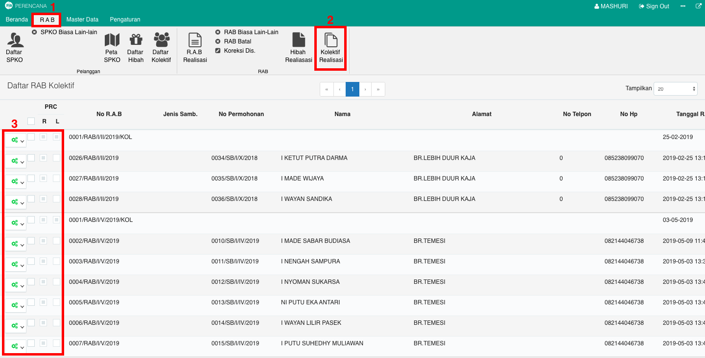
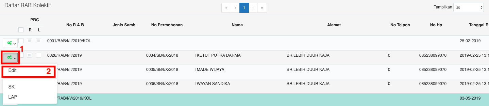
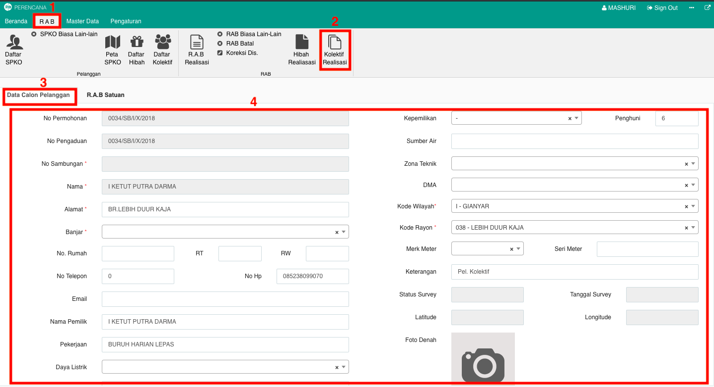
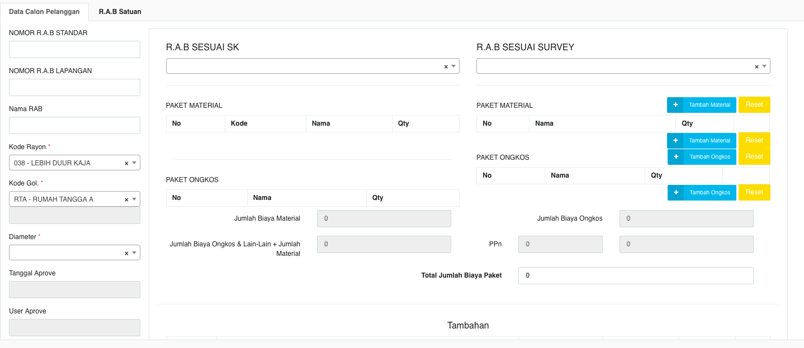
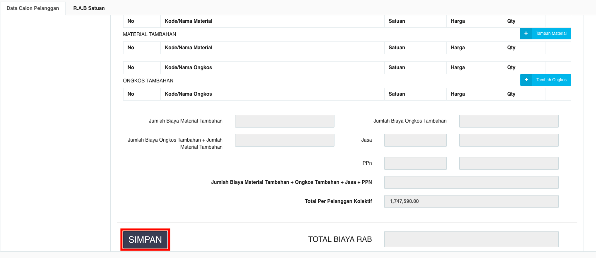

= Mengubah RAB Realisasi Kolektif

Untuk mengubah data RAB Realisasi Kolektif, ikuti langkah-langkah berikut:

1. Pilih menu *RAB*
2. Klik pada ikon *Kolektif Realisasi*
3. Pilih salah satu data yang ingin diubah
4. Pilih tombol *konfigurasi* pada data yang ingin diubah seperti poin 1 pada gambar di bawah ini, kemudian pilih *Edit*
+

5. Isi form pada tab Data Calon Pelanggan yang perlu diubah seperti pada poin 4 gambar di bawah ini
+

6. _Scroll_ halaman ke bawah hingga muncul _field_ Nomor RAB Standar, Nomor RAB Lapangan, RAB sesuai SK, dan RAB sesuai Survey seperti pada gambar di bawah ini
+

7. Setelah semua _field_ pada halaman tersebut diisi sesuai kebutuhan, klik pada tombol *SIMPAN* di bagian paling bawah halaman.
+
