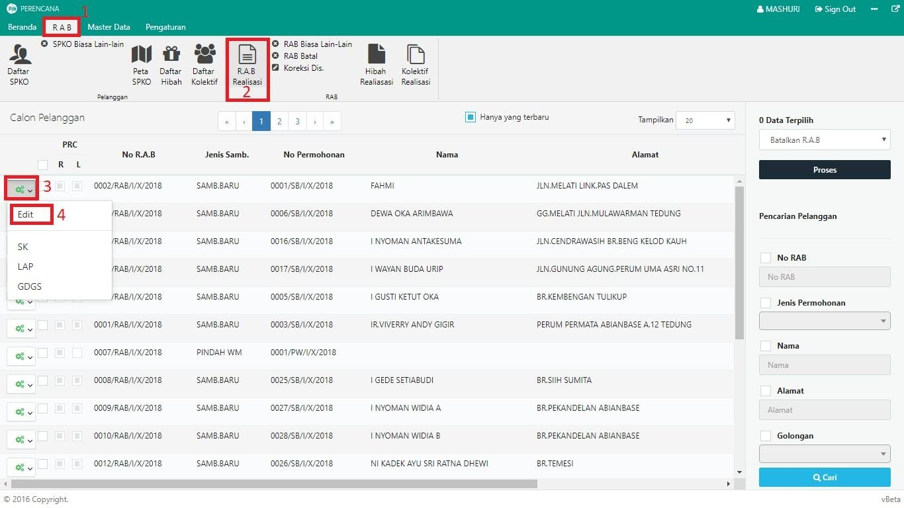

= Mengubah RAB Realisasi

Untuk mengubah RAB Realisasi, ikuti langkah-langkah berikut:

1. Pilih menu *RAB*
2. Klik pada ikon *RAB Realisasi*
3. Pilih tombol *konfigurasi* pada data yang ingin diubah seperti poin 3 pada gambar di atas
4. Pilih *Edit*
5. Ubah *Data Pelanggan* atau *Rincian RAB* sesuai kebutuhan, kemudian klik tombol *SIMPAN*. Seperti pada gambar di bawah ini:
+
