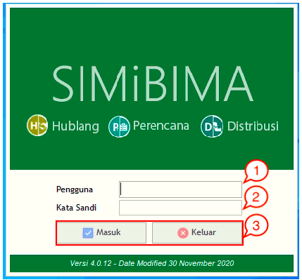

= Login ke Modul Perencanaan

Modul Perencanaan merupakan sistem yang digunakan untuk layanan Bimasakti yang terdiri dari menu *Perencanaan*, *Supervisi Permohonan*, *Laporan*, dan *Master Data*. Seperti yang bisa dilihat melalui gambar di bawah ini, berikut adalah tampilan awal (homepage) modul Perencanaan.

Untuk mengakses modul Perencanaan, silakan mengikuti langkah-langkah berikut:

1. Masukkan *nama pengguna* yang sudah terdaftar
2. Masukkan *kata sandi*
3. Tekan tombol *masuk* untuk masuk ke dalam Aplikasi, Tekan tombol *keluar* apabila hendak keluar dari aplikasi.

