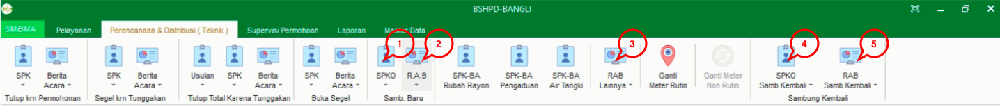
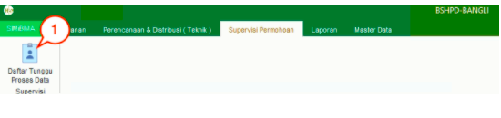
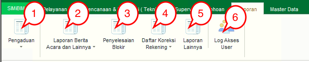
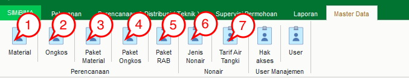

= Menu Modul Perencanaan

Terdapat 4 menu utama dalam Modul Perencanaan, yaitu:

.Menu Perencanaan
[%collapsible]
====

1. Ikon *SPKO Sambungan Baru* untuk melihat daftar SPKO Sambungan Baru yang telah dibuat. Menu ini digunakan untuk membuat SPK, mengoreksi, dan menghapus SPK yang telah dibuat. Pada menu ini terdapat sub-menu Survey Kol. MBR yang disediakan untuk melakukan survey kolektif kepada MBR (Masyarakat Berpenghasilan Rendah).
2. Ikon *R.A.B Sambungan Baru* digunakan untuk melihat RAB sambungan baru yang telah dibuat. Pada menu ini, Anda dapat membuat RAB, mengoreksi, dan menghapus RAB yang telah dibuat. Anda juga dapat membuat RAB kolektif untuk MBR (Masyarakat Berpenghasilan Rendah).
3. Ikon *RAB Lainnya* untuk melihat RAB lainya dari non pelanggan dan pelanggan yang telah dibuat. Pada menu ini, Anda dapat membuat RAB, mengoreksi, dan menghapus RAB yang telah dibuat.
4. Ikon *SPKO Sambung Kembali* digunakan untuk melihat daftar SPKO Sambungan kembali yang telah dibuat. Pada menu ini, Anda dapat membuat SPK, mengoreksi, dan menghapus SPK yang telah dibuat. 
5. Ikon *RAB Sambung Kembali* digunakan untuk melihat RAB sambungan baru yang telah dibuat. Pada menu ini, Anda dapat membuat RAB, mengoreksi, dan menghapus RAB yang telah dibuat.
====

.Menu Supervisi Permohonan
[%collapsible]
====

1. Ikon *Daftar Tunggu Proses Data Supervisi* menyediakan menu untuk supervisi dan validasi proses data yang sudah masuk dalam daftar.
====

.Menu Laporan
[%collapsible]
====

1. Ikon *Pengaduan* menyediakan filter untuk mencari rekap laporan pengaduan yang ditampilkan dalam format PDF.
2. Ikon *Laporan Berita Acara dan Lainnya* menyediakan filter untuk mencari rekap laporan, berita acara dan bon yang ditampilkan dalam format PDF.
3. Ikon *Penyelesaian Blokir* menyediakan filter untuk mencari rekap laporan penyelesaian yang ditampilkan dalam format PDF.
4. Ikon *Daftar Koreksi Rekening* menyediakan filter untuk mencari rekap daftar koreksi rekening penyelesaian yang ditampilkan dalam format PDF.
5. Ikon *Laporan Lainnya* menyediakan filter untuk mencari rekap laporan yang ditampilkan dalam format PDF.
6. Ikon *Log User Akses* untuk melihat aktifitas user yang masuk ke dalam sistem.
====

.Menu Master Data
[%collapsible]
====

1. Ikon *Material* menyediakan menu untuk menampilkan data material yang digunakan. Pada menu ini, Anda dapat menambah data material baru, mengoreksi, dan menghapus material yang telah dibuat.
2. Ikon *Ongkos* menyediakan menu untuk menampilkan ongkos/biaya saat melakukan kegiatan. Pada menu ini, Anda dapat menambah data ongkos/biaya baru, mengoreksi, dan menghapus ongkos/biaya yang telah dibuat.
3. Ikon *Paket Material* Perencanaan menyediakan menu untuk menampilkan paket material yang akan digunakan. Pada menu ini, Anda dapat menambah data paket material perencanaan baru, mengoreksi, dan menghapus paket material perencanaan yang telah dibuat.
4. Ikon *Paket Ongkos* menyediakan menu menyediakan menu untuk menampilkan paket ongkos saat melakukan kegiatan. Pada menu ini, Anda dapat menambah data paket ongkos baru, mengoreksi, dan menghapus  data paket ongkos baru yang telah dibuat.
5. Ikon *Paket RAB* menyediakan menu untuk menampilkan paket RAB yang saat melakukan kegiatan. Pada menu ini, Anda dapat menambah data paket RAB, mengoreksi, dan menghapus paket RAB yang telah dibuat.
6. Ikon *Jenis Nonair* menyediakan menu untuk menampilkan list ongkos jenis nonair yang akan dibebankan pada pelanggan. Pada menu ini, Anda dapat menambah data ongkos jenis nonair, mengoreksi, dan menghapus data ongkos jenis nonair yang telah dibuat.
7. Ikon *Tarif Air Tangki* menyediakan menu untuk menampilkan daftar Tarif Air Tangki. Pada menu ini, Anda dapat menambah data Tarif Air Tangki, mengoreksi, dan menghapus data Tarif Air Tangki yang telah dibuat.
====
