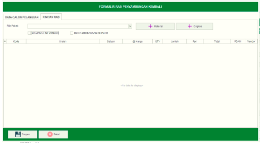

= Mengelola RAB Sambungan Kembali

Fitur *RAB Sambungan Kembali* mencakup Tombol *Refresh*, *Tambah*, *Koreksi*, *Hapus Filter Pencarian*, dan *Action Klik Kanan* pada RAB Sambungan Kembali. Berikut adalah penjelasan masing-masing fungsinya:

1. *Refresh*
+
Tombol *Refresh* digunakan untuk memperbarui data RAB Sambungan Kembali yang mungkin belum masuk ketika data sudah di-_submit_

2. *Tambah RAB Sambungan Kembali*
+
Tombol *Tambah RAB Sambungan Kembali* digunakan untuk menambah data baru dengan klik pada icon *Tambah*. Berikut adalah cara untuk menambah data baru RAB Sambungan Kembali: 

+

+
Untuk menambah data baru pada RAB Sambungan Kembali, lengkapi _form_ Data Calon Pelanggan 
+

+
Setelah mengisi *form data calon pelanggan*, pilih tab *Rincian RAB* untuk mengisi Detail RAB Sambungan Kembali yang akan ditambahkan. Anda dapat menambahkan Material dan Ongkos dengan klik Tombol *Material* atau *Ongkos*.

3. *Koreksi RAB Sambungan Kembali*
+
Tombol *Koreksi* digunakan untuk melakukan koreksi pada data RAB Sambungan Kembali. Untuk melakukan Koreksi, Anda dapat memilih data pada daftar, kemudian klik tombol *Koreksi*.

4. *Hapus RAB Sambungan Kembali*
+
Tombol *Hapus* digunakan untuk menghapus data RAB Sambungan Kembali dari daftar. Untuk menghapus data, pilih data terlebih dahulu, kemudian klik tombol *Hapus*.

5. *Filter Pencarian RAB Sambungan Kembali*
+
_Field_ *Filter* digunakan untuk mencari data RAB Sambungan Kembali sesuai dengan kebutuhan. Untuk melakukan pencarian data, lengkapi _field_ filter, kemudian klik pada tombol *Refresh*.

6. *Action Menu saat diklik kanan*
+
Anda dapat melakukan klik kanan pada _row_ data RAB Sambungan Kembali untuk menampilkan _action menu_. Berikut adalah penjelasan untuk masing-masing _action menu_: 

- *Tambah* :   Untuk menambah data RAB Sambungan Kembali yang Baru

- *Koreksi* : Untuk melakukan koreksi (edit) terhadap data RAB Sambungan Kembali  yang dipilih

- *Hapus* : Untuk menghapus terhadap data RAB Sambungan Kembali  yang dipilih

- *Cetak R.A.B & RKP* : Untuk melakukan mencetak RAB Sambungan Kembali yang dipilih

- *Koreksi RKP* :  Untuk melakukan koreksi (edit) RKP terhadap data RAB Sambungan Kembali  yang dipilih

- *Upload Denah* : Untuk melakukan upload Denah pelanggan sesuai dengan data yang dipilih

- *Cetak Denah*  : Untuk mencetak Denah pelanggan sesuai dengan data yang dipilih

- *Buat Bukti Persetujuan Pembayaran Instalasi (BPPI)*: untuk membuat bukti BPPI sesuai dengan data yang dipilih

- *Cetak SPKP* : untuk mencetak SPKP sesuai dengan data yang dipilih dalam list data RAB Sambungan Kembali

- *Buat Surat Permintaan Pengambilan Barang (SPPB)* : untuk membuat surat SPPB sesuai dengan data yang dipilih dalam list data RAB Sambungan Kembali

- *Buat Berita Cara Pemasangan* : untuk membuat Berita Acara (BA) pemasangan sesuai dengan data yang dipilih pada list RAB Sambungan Kembali

- *Cetak BAP* :  uuk mencetak BAP sesuai dengan data yang dipilih pada daftar RAB Sambungan Kembali 

- *Export Excel* : untuk melakukan _export_ data RAB Sambungan Kembali dalam format Excel