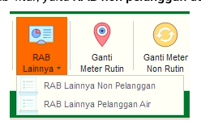
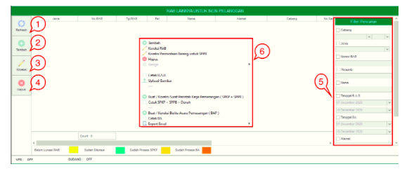
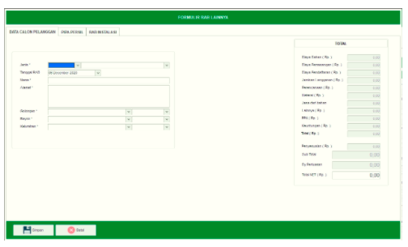
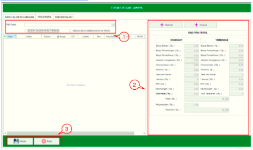
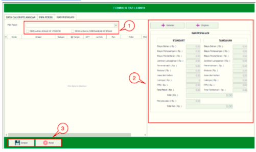
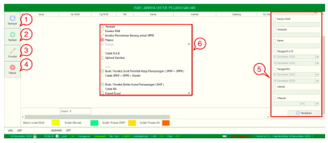
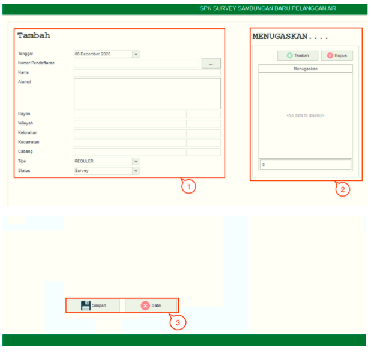
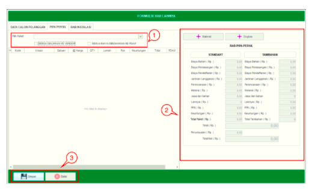
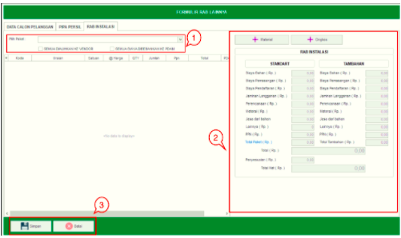

= Mengelola RAB lainnya Pelanggan dan Non Pelanggan

Untuk mengakses menu RAB lainnya Pelanggan dan Non Pelanggan, Anda dapat mengakses Menu *RAB Lainnya*.

== RAB Lainnya untuk Non Pelanggan

Fitur ini digunakan untuk membuat data RAB Lainnya Non Pelanggan. Terdapat 4 _action button_ yang dapat digunakan, yaitu *Refresh*, *Tambah*, *Koreksi*, dan *Hapus*. Berikut adalah penjelasan masing-masing tombol dan fungsi dalam RAB Lainnya Non Pelanggan :

1. *Refresh RAB Lainnya Non Pelanggan*
+
Tombol *Refresh* digunakan untuk memperbarui data baru yang mungkin belum masuk ketika data sudah di-_submit_.

2. *Tambah RAB Lainnya Non Pelanggan*
+
Tombol *Tambah* digunakan untuk menambah data baru dengan klik pada icon Tambah. Terdapat 3 jenis data yang ditambahkan, yaitu Data *Calon Pelanggan*, *Pipa Persil*, dan *RAB Instalasi*. Berikut adalah cara untuk menambah data baru :

- *Tambah Data Calon Pelanggan*
+

+
Untuk menambahkan data baru pada *Data Calon Pelanggan*, Lakukan klik pada icon *Tambah*. Isi data calon pelanggan pada form yang tersedia, kemudian klik tombol *Simpan*. 

- *Tambah Data Pipa Persil*
+

+

Tambahkan data baru Pipa Persil dengan mengikuti cara berikut : 
+

[arabic]
... Pilih *paket* yang akan ditambahkan dan Lakukan *Centang* untuk beban biaya (Semua dialihkan ke vendor atau semua biaya dibebankan ke PDAM)

... Anda bisa menambahkan data Material dengan Klik tombol *Material* untuk ditambahkan ke dalam rincian RAB. Anda bisa menambahkan *data Ongkos* dengan Klik tombol *Ongkos* untuk ditambahkan ke dalam rincian RAB

... Klik tombol *Simpan* untuk menambahkan data baru Pipa Persil.

- *Tambah RAB Instalasi*
+

+

Untuk menambah data baru pada Pipa Steril dengan cara berikut : 
+

[arabic]
... Pilih *Paket* yang akan ditambahkan dan Lakukan Centang untuk beban biaya (Semua dialihkan ke vendor atau semua biaya dibebankan ke PDAM)

... Anda bisa menambahkan data *Material* dengan melakukan klik tombol *Material* untuk ditambahkan ke dalam rincian RAB. Anda bisa menambahkan data *Ongkos* dengan klik tombol *Ongkos* untuk ditambahkan ke dalam rincian RAB

... Klik tombol *simpan* untuk menambahkan data baru RAB Instalasi.

3. *Koreksi RAB Lainnya Non Pelanggan*
+
Tombol *Koreksi* digunakan untuk melakukan koreksi pada data *RAB Lainnya Non Pelanggan*. Proses dapat dilakukan dengan memilih data yang akan dikoreksi pada daftar, kemudian klik pada tombol *Koreksi*.

4. *Hapus RAB Lainnya Non Pelanggan*
+
Tombol *Hapus* digunakan untuk menghapus data *RAB Lainnya Non Pelanggan* dalam daftar. Untuk menghapus data, Anda dapat memilih data dalam daftar, kemudian klik tombol *Hapus*.

5. *Filter Pencarian RAB Lainnya Non Pelanggan*
+
_Field_ *Filter* digunakan untuk mencari data RAB Lainnya Non Pelanggan sesuai dengan kebutuhan. Untuk melakukan pencarian data, Anda dapat mengisi _form_ sesuai dengan _field_ yang sudah ditentukan, kemudian klik pada tombol *Tampilkan*.

6. *Action Menu saat diklik kanan* 
+
Anda dapat melakukan klik kanan pada _row_ data RAB Lainnya untuk Pelanggan Non-Air untuk menampilkan _action menu_. Berikut adalah penjelasan untuk masing-masing _action menu_: 

- *Tambah* : untuk menambah data RAB Lainnya Non Pelanggan

- *Koreksi* : untuk melakukan koreksi (edit) terhadap data RAB Lainnya Non Pelanggan  yang dipilih

== RAB Lainnya untuk pelanggan Air

Fitur ini digunakan untuk membuat data *RAB Lainnya Pelanggan*. Terdapat 4 action button yang bisa digunakan, yaitu *Refresh*, *Tambah*, *Koreksi*, dan *Hapus*. Berikut adalah penjelasan masing-masing tombol dan fungsi pada *RAB Lainnya Pelanggan Air* :

1. *Refresh RAB Lainnya Pelanggan*
+
Tombol *Refresh* digunakan untuk memperbarui data baru yang mungkin belum masuk ketika data sudah di-_submit_.

2. *Tambah RAB Lainnya Pelanggan*
+
Tombol *Tambah* digunakan untuk menambah data baru dengan klik pada icon *Tambah*. Terdapat 3 Jenis Data yang ditambahkan, yaitu *Data Calon Pelanggan*, *Pipa Persil*, dan *RAB Instalasi*. Berikut adalah cara untuk menambah data baru :

- *Tambah Data Calon Pelanggan*
+

+
Untuk menambahkan data baru pada *Data Calon Pelanggan* dengan cara klik icon Tambah, isi _form_ yang tersedia, kemudian klik tombol *Simpan*. 

- *Tambah Data Pipa Persil*
+

+
Anda dapat menambah data baru pada Pipa Persil dengan mengikuti langkah-langkah berikut : 
+
[arabic]
... Pilih *paket* yang akan ditambahkan dan Lakukan Centang untuk beban biaya (Semua dialihkan ke vender atau semua biaya dibebankan ke PDAM)

... Anda bisa menambahkan data *Material* dengan Klik tombol *Material* untuk ditambahkan ke dalam rincian RAB. Anda bisa menambahkan data Ongkos dengan Klik tombol Ongkos untuk ditambahkan ke dalam rincian RAB

... Klik tombol *Simpan* untuk menambahkan data baru Pipa Persil.

- *Tambah RAB Instalasi*
+

+
Untuk menambah data baru pada Pipa Steril dengan cara berikut : 
+
[arabic]
... Pilih *Paket* yang akan ditambahkan dan Lakukan Centang untuk beban biaya (Semua dialihkan ke vender atau semua biaya dibebankan ke PDAM)

... Anda bisa menambahkan data *Material* dengan Klik tombol *Material* untuk ditambahkan ke dalam rincian RAB. Anda bisa menambahkan data *Ongkos* dengan Klik tombol *Ongkos* untuk ditambahkan ke dalam rincian RAB

... Klik tombol *Simpan* untuk menambahkan data baru RAB Instalasi.

3. *Koreksi RAB Lainnya Pelanggan Air*
+
Tombol *Koreksi* digunakan untuk melakukan koreksi pada data RAB Lainnya Pelanggan Air. Proses dapat dilakukan dengan memilih data yang akan dikoreksi pada daftar, kemudian klik pada tombol *Koreksi*.

4. *Hapus RAB Lainnya Pelanggan Air*
+
Tombol *Hapus* digunakan untuk menghapus data RAB Lainnya Pelanggan Air dari daftar. Untuk menghapus data, Anda dapat memilih data dalam daftar, kemudian klik tombol *Hapus*.

5. *Filter Pencarian RAB Lainnya Pelanggan Air*
+
_Field_ *Filter* digunakan untuk mencari data RAB Lainnya Non Pelanggan sesuai dengan kebutuhan. Untuk melakukan pencarian data, Anda dapat mengisi _form_ sesuai dengan _field_ yang sudah ditentukan, kemudian klik tombol *Tampilkan*.

6. *Action Menu saat diklik kanan*
+
Anda dapat melakukan klik kanan pada _row_ data RAB Lainnya untuk Pelanggan Air untuk menampilkan _action menu_. Berikut adalah penjelasan untuk masing-masing _action menu_: 

- *Tambah* : untuk menambah data *RAB Lainnya Pelanggan Air*

- *Koreksi* : untuk melakukan koreksi (edit) terhadap data RAB Lainnya Pelanggan Air  yang dipilih

- *Koreksi Permintaan Barang untuk SPPB* : Untuk melakukan koreksi (edit) Permintaan Barang untuk SPPB terhadap data RAB Lainnya Pelanggan Air  yang dipilih

- *Hapus* : untuk menghapus terhadap data  RAB Lainnya Pelanggan Air  yang dipilih

- *Cetak RAB* :  untuk mencetak RAB Lainnya Pelanggan Air sesuai dengan data yang dipilih

- *Upload Gambar* : untuk melakukan upload gambar sesuai data yang dipilih, untuk melengkapi data RAB Lainnya Pelanggan Air

- *Buat / Koreksi Surat Perintah Kerja Pemasangan (SPKP + SPPB)* : untuk membuat dan mengoreksi SPKP dan SPPB sesuai dengan data RAB Lainnya Pelanggan Air yang dipilih

- *Cetak SPKP + SPPB + Denah* : untuk mencetak SPKP,SPPB dan Denah sesuai dengan data yang dipilih

- *Buat / Koreksi Berita Acara Pemasangan (BAP)* : untuk membuat dan mengoreksi BAP sesuai dengan data yang dipilih

- *Cetak BA* : untuk mencetak Berita Acara (BA) sesuai dengan data yang dipilih

- *Export Excel* : Untuk melakukan _export_ data RAB Lainnya Pelanggan Air berupa file Excel