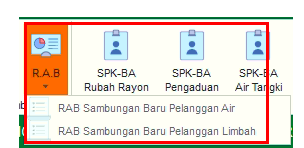
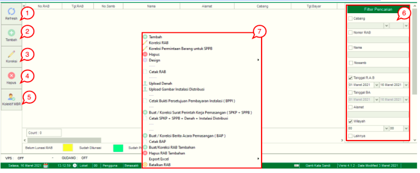
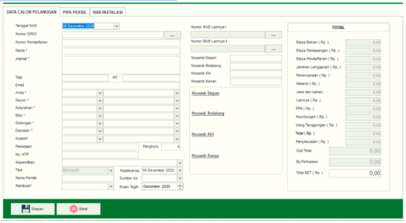
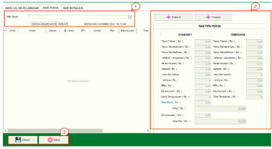
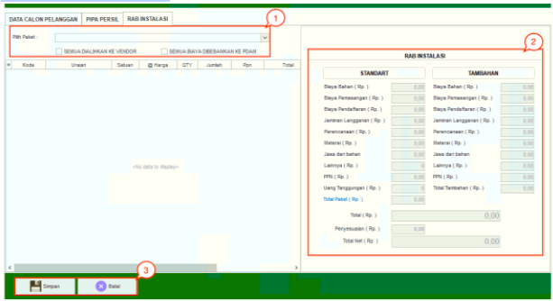

= Mengelola RAB

Fitur ini terdiri dari sub fitur *RAB Sambungan Baru Pelanggan Air* dan *RAB Sambungan Baru Pelanggan Limbah*. Di dalam menu RAB kita dapat melakukan *Refresh*, *Tambah Data*,  *Koreksi*, *Hapus*, *Kolektif MBR*, *Filter Data* dan *action Klik kanan*. Berikut adalah penjelasan fungsi yang ada di dalamnya:

1. *Refresh RAB Sambungan Baru* 
+
Tombol *Refresh* digunakan untuk memperbarui data baru yang mungkin belum masuk ketika data sudah di-_submit_

2. *Tambah RAB Sambungan Baru*
+
Tombol *Tambah* digunakan untuk menambah data baru dengan klik pada icon *Tambah*. Terdapat 3 jenis data yang ditambahkan yaitu *Data Calon Pelanggan*, *Pipa Persil*, dan *RAB Instalasi*. Berikut cara untuk menambah data baru :

- *Tambah Data Calon Pelanggan*
+

Untuk menambahkan data baru pada *Data Calon Pelanggan* dengan cara klik icon *Tambah*, isi *form yang tersedia*, kemudian klik tombol *Simpan*.

- *Tambah Data Pipa Persil*
+

+
Untuk menambah data baru pada Pipa Persil, Anda dapat mengikuti cara berikut :
+

[arabic]
... Pilih *paket* yang akan ditambahkan dan Lakukan Centang untuk beban biaya (Semua dialihkan ke vendor atau semua biaya dibebankan ke PDAM)

... Anda bisa menambahkan data *Material* dengan Klik tombol Material untuk ditambahkan ke dalam rincian RAB. Anda bisa menambahkan data *Ongkos* dengan klik tombol *Ongkos* untuk ditambahkan ke dalam rincian RAB

... Klik tombol *simpan* untuk menambahkan data baru Pipa *Persil*.

- *Tambah RAB Instalasi*
+

+
Untuk menambah data baru RAB Instalasi, Anda dapat mengikuti langkah-langkah berikut : 
+

[arabic]
... Pilih *Paket* yang akan ditambahkan dan Lakukan Centang untuk beban biaya (Semua dialihkan ke vender atau semua biaya dibebankan ke PDAM)

... Lengkapi data *RAB Instalasi*

... Klik tombol *Simpan* untuk menambahkan data baru RAB Instalasi.

3. *Koreksi RAB Sambungan Baru Pelanggan* 
+
Tombol *Koreksi* digunakan untuk melakukan koreksi pada data *RAB Sambungan Baru Pelanggan*. Untuk melakukan Koreksi Anda dapat memilih data yang dikoreksi, kemudian klik tombol *Koreksi*.

4. *Hapus RAB Sambungan Baru Pelanggan* 
+
Tombol *Hapus* digunakan untuk menghapus data *RAB Sambungan Baru Pelanggan* dari daftar. Untuk menghapus Anda dapat memilih data tersebut, kemudian klik tombol *Hapus*.

5. *Kolektif MBR*
+
Tombol *Kolektif MBR* digunakan untuk melihat daftar pelanggan yang ingin melakukan *RAB Sambungan Baru Pelanggan* secara kolektif. 

6. *Filter Pencarian RAB Sambungan Baru Pelanggan* 
+
_Field_ *Filter* digunakan untuk mencari data *RAB Sambungan Baru Pelanggan Air* sesuai dengan kebutuhan. Untuk melakukan pencarian, Anda dapat mengisi _form_ sesuai dengan _field_ yang sudah ditentukan, kemudian klik pada tombol *Refresh*.

7. *Action Menu saat diklik kanan*
+
Anda dapat melakukan klik kanan pada _row_ *data RAB Sambungan Baru* untuk menampilkan _action menu_. Berikut adalah penjelasan untuk masing-masing _action menu_:

- *Tambah*: Untuk menambah data RAB Sambungan Baru Pelanggan 

- *Koreksi RAB*: Untuk melakukan koreksi (edit) terhadap data RAB Sambungan Baru Pelanggan dipilih

- *Koreksi Permintaan Barang untuk SPPB*:  Untuk melakukan koreksi (edit) terhadap SPPB

- *Hapus*: Untuk menghapus data yang RAB Sambungan Baru Pelanggan 

- *Cetak RAB*: Untuk mencetak RAB Sambungan Baru Pelanggan

- *Upload Denah*: Untuk mengunggah denah lokasi 

- *Upload Gambar Instalasi Distribusi*: Untuk mengunggah gambar instalasi distribusi

- *Cetak Bukti Persetujuan Pembayaran Instalasi (BPPI)*: Untuk mengunggah bukti persetujuan pembayaran instalasi

- *Buat/Koreksi Surat Perintah Perintah Kerja Pemasangan (SPKP + SPPB)*: Untuk membuat/mengoreksi SPKP dan SPPB

- *Cetak SPKP + SPPB + Denah + Instalasi Distribusi*: Untuk mencetak SPKP, SPPB, Denah dan Instalasi Distribusi 

- *Buat/Koreksi Berita Acara Pemasangan*: Untuk membuat/mengoreksi BAP

- *Cetak BAP*: Untuk mencetak BAP

- *Buat/Koreksi RAB Tambahan*: Untuk membuat/mengoreksi RAB tambahan

- *Hapus RAB Tambahan*: Untuk menghapus RAB tambahan 

- *Export Excel*: Untuk _export_ data yang dipilih ke format Excel

- *Batalkan RAB* : Berbeda dengan menu Hapus RAB yang hanya menghapus data RAB saja, pilihan Batalkan RAB akan menghapus seluruh data mulai dari pendaftaran hingga survey.