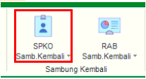
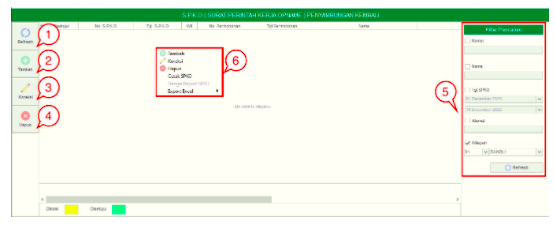
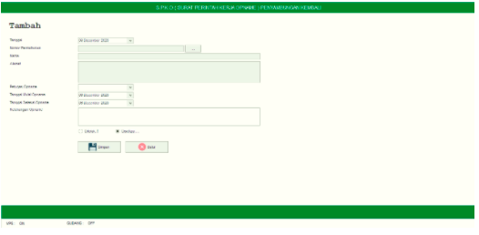

= Mengelola SPKO Sambungan Kembali

Fitur *SPKO Sambungan Kembali* mencakup Tombol *Refresh*, *Tambah*, *Koreksi*, *Hapus*, *Filter Pencarian*, dan *Action Klik Kanan*. Berikut ini adalah penjelasan masing-masing fungsinya: 

1. *Refresh*
+
Tombol *Refresh* digunakan untuk memperbarui data SPKO Sambungan Kembali  yang mungkin belum masuk ketika data sudah di-_submit_.

2. *Tambah SPKO Sambungan Kembali*
+
Tombol *Tambah* digunakan untuk menambah data baru SPKO Sambungan Kembali. Berikut cara untuk menambah data baru SPKO Sambungan Kembali : 
+

+
- Isi *form yang tersedia*, kemudian klik tombol *Simpan* untuk menambahkan Data SPKO Sambungan Kembali.

3. *Koreksi SPKO Sambungan Kembali*
+
Tombol *Koreksi* digunakan untuk melakukan koreksi pada data SPKO Sambungan Kembali. Untuk melakukan Koreksi, Anda dapat memilih data pada daftar, kemudian klik pada tombol *Koreksi*

4. *Hapus SPKO Sambungan Kembali*
+
Tombol *Hapus* digunakan untuk menghapus data SPKO Sambungan Kembali dari daftar. Untuk menghapus data, Anda dapat dengan memilih data yang akan dihapus, kemudian klik tombol *Hapus*.

5. *Filter Pencarian SPKO Sambungan Kembali*
+
_Field_ *Filter* digunakan untuk mencari data SPKO Sambungan Kembali sesuai dengan kebutuhan. Untuk mencari data, Anda dapat mengisi _form_ filter, kemudian klik pada tombol *Refresh*.

6. *Action Menu saat diklik kanan* 
+
Anda dapat melakukan klik kanan pada _row_ data SPKO Sambungan Kembali untuk menampilkan _action menu_. Berikut adalah penjelasan untuk masing-masing _action menu_: 

- *Tambah* : Untuk menambah data  baru SPKO Sambungan Kembali

- *Koreksi* : Untuk melakukan koreksi (edit) terhadap data SPKO Sambungan Kembali  yang dipilih

- *Hapus* : Untuk menghapus data SPKO Sambungan Kembali yang dipilih

- *Cetak SPKO* : Untuk mencetak SPKO Sambungan Kembali

- *Export Excel* : Untuk melakukan _export_ data SPKO Sambungan Kembali berupa _file_ Excel