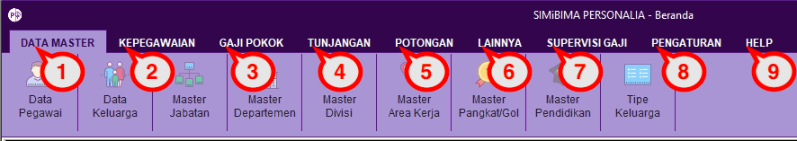

= Menu Personalia

1. *Menu Data Master*
+
Menu ini digunakan untuk mengatur data pegawai, data keluarga, mengatur jenis jabatan, departemen, divisi, pangkat golongan, pendidikan, dan tipe keluarga.
2. *Menu Kepegawaian*
+
Menu ini digunakan untuk penginputan SK (Surat Keputusan) yang sudah jadi dan resmi untuk  calon pegawai kontrak, pegawai tetap, kenaikan pangkat berkala atau pilihan, pensiun, mutasi pegawai, perjalanan dinas, diklat dan pelatihan sampai ke fitur laporan kepegawaian.
3. *Menu Gaji Pokok*
+
Menu ini berfungsi untuk menampilkan perolehan gaji yang akan diterima oleh pegawai berdasarkan Masa Kerja Golongan (MKG) setiap pegawai yang sesuai ditentukan.
4. *Menu Tunjangan*
+
Menu ini digunakan untuk mengatur jenis tunjangan, hak tunjangan bulanan, pengecualian tunjangan, pengajuan lembur, dan laporan lembur.
5. *Menu Potongan*
+
Menu ini digunakan untuk mengatur jenis potongan, potongan bulanan (menambahkan dan menghapus), dan pengecualian hak potongan.
6. *Menu Lainya*
+
Menu ini digunakan untuk mengatur hal lain terkait kepegawaian seperti status keluarga pegawai, dasar pensiun, dasar askes, dan dasar astek.
7. *Menu Supervisi Gaji*
+
Menu ini digunakan untuk mengatur rekap absensi, periode posting gaji, posting gaji, supervisi gaji & THR, dan mencetak laporan gaji.
8. *Menu Pengaturan*
+
Menu ini digunakan untuk mengatur hak akses pengguna, backup database, laporan kepegawaian, dan laporan penggajian.
9. *Menu Help*
+
Menu ini diperuntukkan untuk admin. Biasanya dipakai untuk melakukan penyesuaian mulai dari jabatan, pangkat, MKG pegawai, jadwal kenaikan, pendidikan pegawai dan perubahan gaji pokok. Untuk bisa mengakses menu ini harus memasukkan password untuk masuk ke menu *Super User*.
