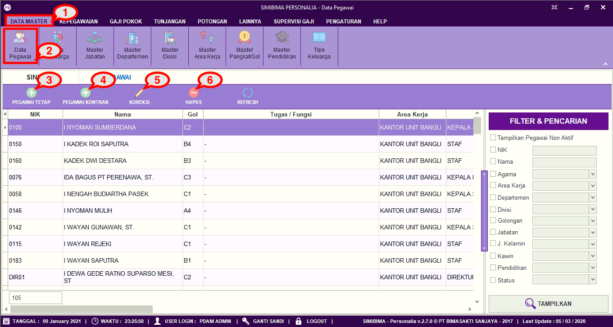
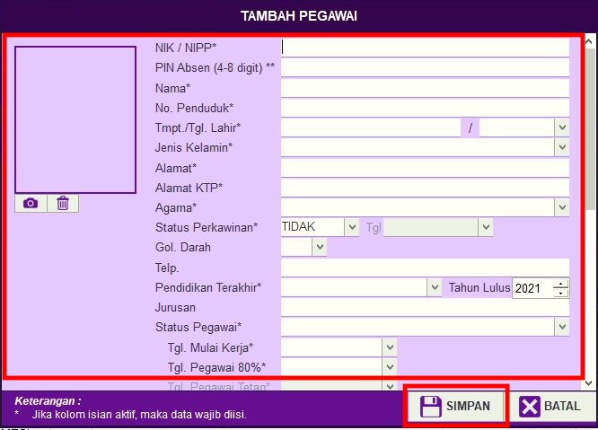
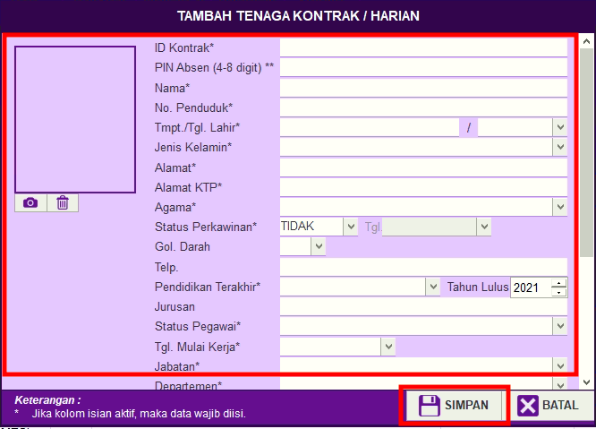
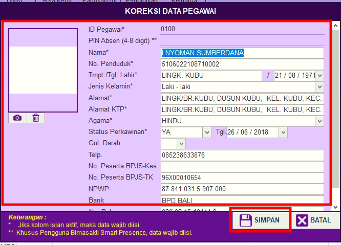
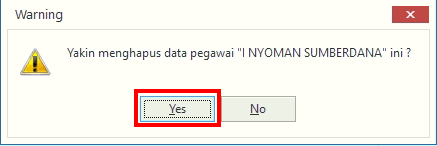

= Menambah Memperbarui dan Menghapus Data Pegawai

Fitur ini berfungsi untuk mengatur data pegawai, baik itu menambahkan pegawai tetap/kontrak, memperbarui, dan menghapus data pegawai. Berikut langkah yang bisa diikuti untuk menggunakannya.

1. Pilih menu *Data Master*
2. Cari ikon *Data Pegawai*
3. Untuk menambahkan data pegawai tetap, klik pada tombol *Pegawai Tetap* seperti poin 3 pada gambar di atas. Selanjutnya isi _form_ data pegawai tetap. Jika sudah, klik tombol *Simpan* seperti pada gambar di bawah ini
+

4. Untuk menambahkan pegawai kontrak klik pada tombol *Pegawai Kontrak* seperti poin 4 pada gambar di atas. Selanjutnya isi _form_ data tenaga kontrak. Jika sudah, klik tombol *Simpan* seperti pada gambar di bawah ini
+

5. Untuk memperbarui data, pilih data yang ingin User perbarui terlebih dahulu. Selanjutnya klik pada ikon *Koreksi*, perbarui bagian yang ingin diubah. Jika sudah, klik tombol *Simpan* seperti pada gambar di bawah ini
+

6. Untuk menghapus data, pilih data yang ingin dihapus terlebih dahulu. Klik tombol *Hapus*, selanjutnya akan muncul _pop up_ konfirmasi. Jika sudah yakin untuk menghapus data pegawai, klik tombol *Yes* seperti pada gambar di bawah ini.
+

