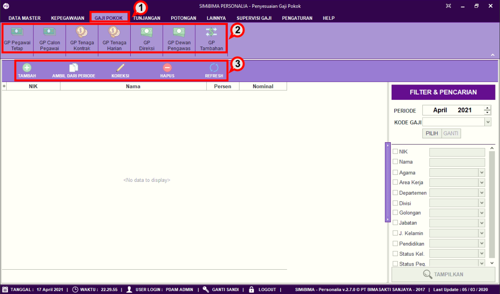

= Memasukkan Gaji Pokok 

Fitur ini berfungsi untuk melakukan input jumlah gaji tenaga kontrak, berikut langkah-langkahnya.

1. Pilih menu *Gaji Pokok*
2. Pilih dan Klik ikon *GP Pegawai Tetap*, *GP Dewan Pengawas*, *GP Tenaga Kontrak*, *GP Tenaga Harian*, *GP Tenaga Harian*, *GP Dewan Pengawas*, atau *GP Pokok Tambahan* 
3. Pilih salah satu ikon di bawah sub menu Gaji Pokok. User bisa memilih ikon *Tambah, Koreksi, Hapus,* atau *Refresh*.
