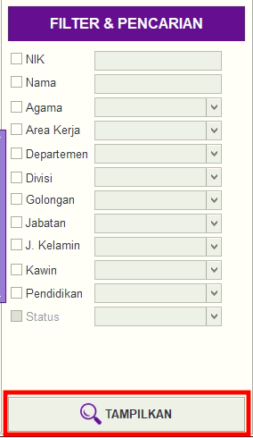

= Memfilter Data Gaji Pokok

Fitur ini sendiri ada di setiap sub menu, berfungsi untuk mem-filter rentang data berdasarkan kriteria yang ditetapkan. Berikut langkah-langkah untuk menggunakannya.

1. Fitur ini dapat ditemukan di sidebar sebelah layar laptop/komputer User
2. Pilih filter berdasarkan “NIK”, “Nama”, “Agama”, “Area Kerja”, “Departemen”, “Divisi”, “Golongan”, “Jabatan”, “ Jenis Kelamin”, “Kawin”, ”Pendidikan”, dan “Status”
3. Penggunaan filter bisa digunakan secara keseluruhan maupun sebagian
4. Setelah selesai, terapkan *Filter & Pencarian Data* dengan mengklik tombol *Tampilkan*.