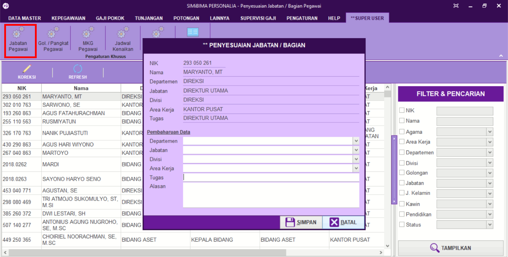

= Mengatur Data Jabatan atau Bagian Pegawai

Fitur ini berfungsi untuk mengatur data jabatan / bagian dari si pegawai. Berikut langkah yang bisa diikuti untuk menggunakannya.

1. Pilih menu *Super User*
2. Selanjutnya cari ikon *Jabatan Pegawai*
3. Pilih ikon *Koreksi*, setelah itu akan muncul kotak dialog *Penyesuaian Jabatan / Bagian*.
4. Masukkan pembaharuan data. Setelah selesai klik *Simpan*
5. Lalu klik ikon *Refresh* untuk memperbarui data yang sudah dimasukkan.
