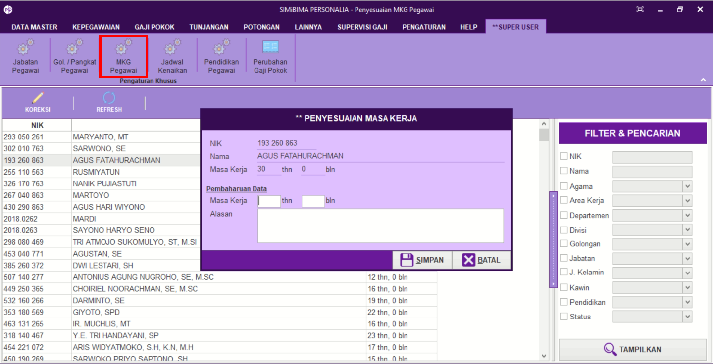

= Mengatur Data Masa Kerja Pegawai

Fitur ini berfungsi untuk mengatur data masa kerja pegawai. Berikut langkah yang bisa diikuti untuk menggunakannya.

1. Pilih menu *Super User*
2. Selanjutnya cari ikon *MKG Pegawai*
3. Pilih ikon *Koreksi*. Setelah itu akan muncul kotak dialog *Penyesuaian Masa Kerja*
4. Masukkan pembaharuan data. Setelah selesai klik *Simpan*
5. Lalu klik ikon *Refresh* untuk memperbarui data yang sudah dimasukkan.
