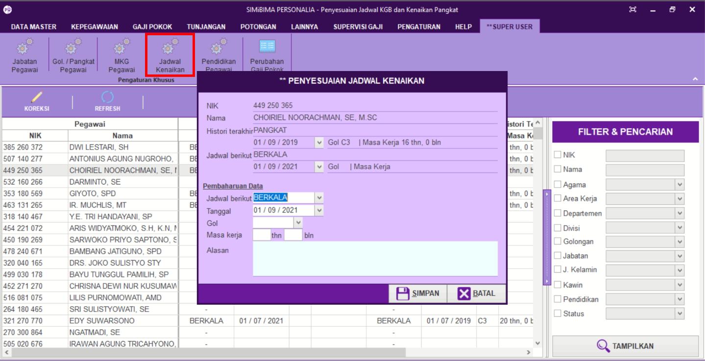

= Mengatur Jadwal Kenaikan Pangkat

Fitur ini berfungsi untuk mengatur jadwal kenaikan. Berikut langkah yang bisa diikuti untuk menggunakannya.

1. Pilih menu *Super User*
2. Selanjutnya cari ikon *Jadwal Kenaikan*
3. Pilih ikon *Koreksi*, setelah itu akan muncul kotak dialog *Penyesuaian Jadwal Kenaikan*
4. Masukkan pembaharuan data. Setelah selesai klik *Simpan*
5. Lalu klik ikon *Refresh* untuk memperbarui data yang sudah dimasukkan.