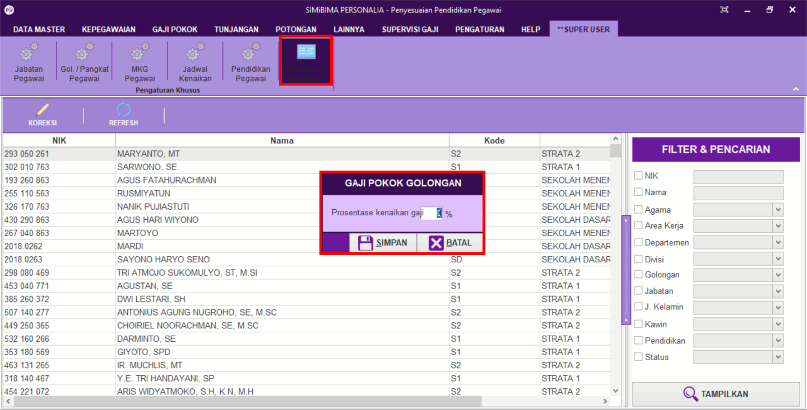

= Mengatur Persentase Kenaikan Gaji

Fitur ini berfungsi untuk mengatur persentase kenaikan gaji. Berikut langkah yang bisa diikuti untuk menggunakannya.

1. Pilih menu *Super User*
2. Selanjutnya cari ikon *Perubahan Gaji Pokok*
3. Pilih ikon *Koreksi*, setelah itu akan muncul kotak dialog *Gaji Pokok Golongan* 
4. Masukkan pembaharuan data. Setelah selesai, klik *Simpan*
5. Lalu klik ikon *Refresh* untuk memperbarui data yang sudah dimasukkan.
