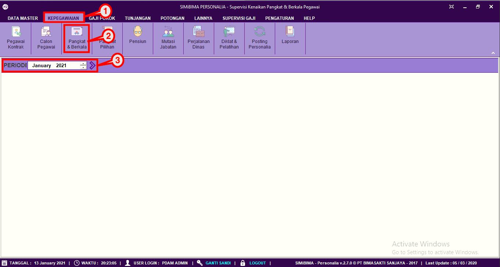
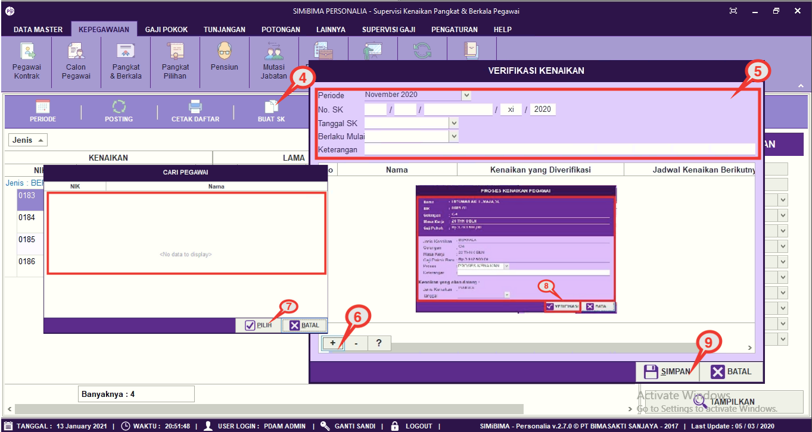

= Mengatur Data Kenaikan Pangkat Berkala

Fitur ini berfungsi untuk mengatur kenaikan pangkat berkala, seperti memperbarui periode, melakukan posting, mencetak daftar, dan pembuatan SK. Berikut langkah-langkahnya:

1. Pilih menu *Kepegawaian*
2. Cari ikon *Pangkat & Berkala*
3. Pilih periode yang ingin diproses
4. Selanjutnya pilih ikon *Buat SK*, seperti poin 4 pada gambar di bawah ini
+

5. Masukkan No. SK, Tanggal SK, Tanggal berlaku SK dan keterangan
6. Klik pada tombol (*+*) untuk melihat daftar pegawai
7. Pilih pegawai yang akan mengalami kenaikan jabatan, jika sudah klik pada tombol *Pilih*
8. Lengkapi form proses kenaikan jabatan, klik pada tombol *Verifikasi*
9. Jika data sudah terisi dengan benar, klik tombol *Simpan* untuk melakukan proses verifikasi kenaikan jabatan pegawai.