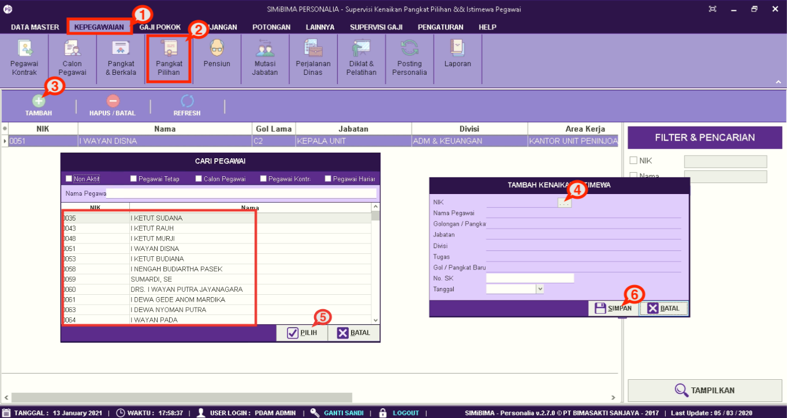

= Mengatur Data Kenaikan Pangkat Pilihan

Fitur ini berfungsi untuk mengatur pangkat pilihan untuk pegawai yang akan mengalami proses kenaikan pangkat pilihan, baik itu menambahkan, menghapus data, dan melakukan refresh halaman. Berikut langkah yang bisa diikuti untuk menggunakannya.

1. Pilih menu *Kepegawaian*
2. Selanjutnya cari ikon *Pangkat Pilihan*
3. Pilih ikon *Tambah*
4. Pilih seperti poin 4 pada gambar di atas
5. Pilih pegawai yang akan mengalami proses kenaikan pangkat pilihan, jika sudah klik pada tombol *Pilih*
Masukkan No. SK dan Tanggal
Jika semua data sudah diisi dengan benar, klik tombol *Simpan* untuk menyimpan data kenaikan jabatan pilihan.