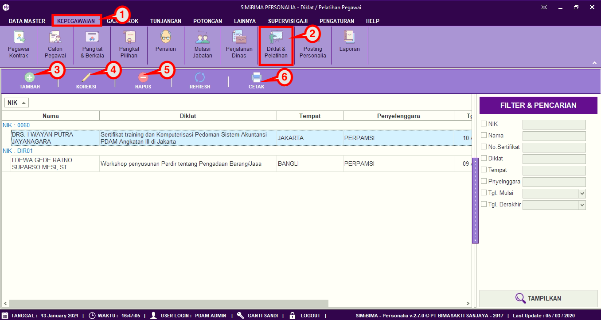
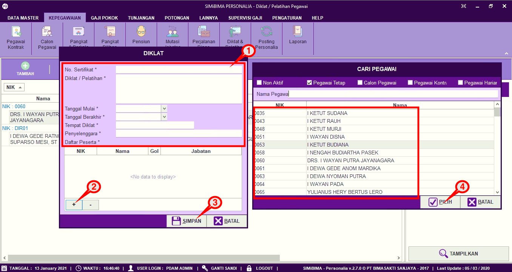
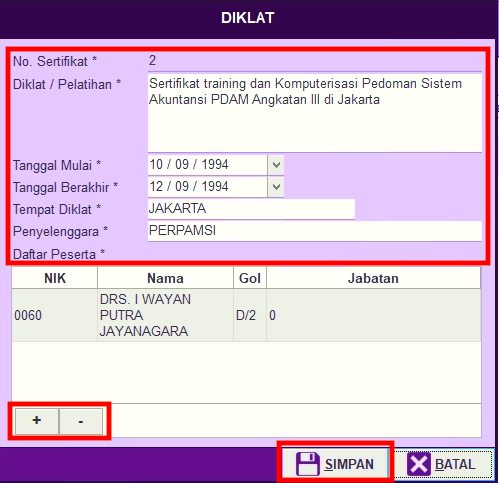
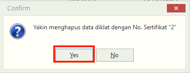

= Mengatur Pencatatan Data Diklat dan Pelatihan

Fitur ini berfungsi untuk mengatur pencatatan diklat dan pelatihan, baik itu menambahkan, memperbarui, dan menghapus data. Berikut langkah yang bisa diikuti untuk menggunakannya.

== Menambahkan Form Diklat
1. Pilih menu *Kepegawaian*
2. Cari ikon *Diklat & Pelatihan*
3. Untuk menambahkan jenis jabatan klik pada tombol *Tambah* seperti poin 3 pada gambar di atas
4. Selanjutnya lengkapi form penambahan diklat. Jika sudah klik tombol *Simpan* untuk menambah jenis jabatan baru seperti pada gambar di bawah ini
+

== Memperbarui Data
1. Untuk memperbarui data, pilih data yang ingin diperbarui terlebih dahulu. Selanjutnya klik pada ikon *Koreksi*. Untuk menambah pegawai dalam daftar diklat klik pada tombol (*+*). Jika ingin mengurangi klik tombol (*-*). Setelah itu perbarui bagian yang ingin diubah, lalu klik tombol *Simpan* seperti gambar di bawah ini.
+

== Menghapus Data
1. Untuk menghapus data, pilih data yang ingin dihapus terlebih dahulu. Selanjutnya klik pada ikon *Hapus* sampai muncul _pop up_ konfirmasi. Jika sudah yakin untuk menghapus jenis jabatan, klik tombol *Yes* seperti gambar di bawah ini
+

2. Untuk mencetak laporan diklat dan pelatihan, pilih data perjalanan dinas yang ingin dicetak. Selanjutnya klik pada ikon *Cetak*, seperti poin 6 pada gambar utama di atas. 