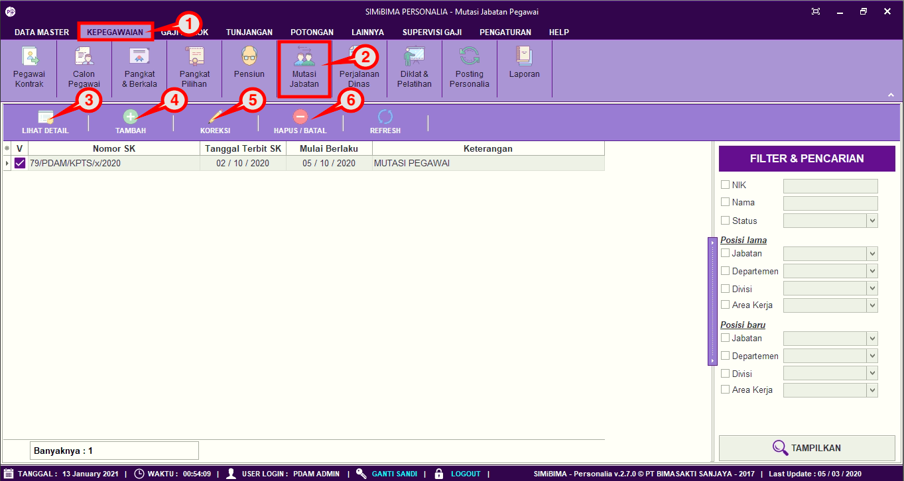
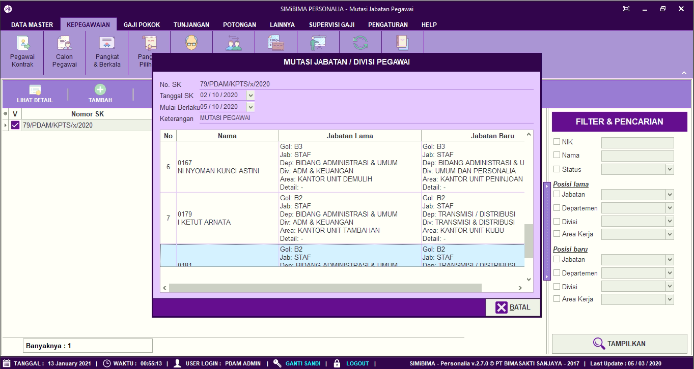
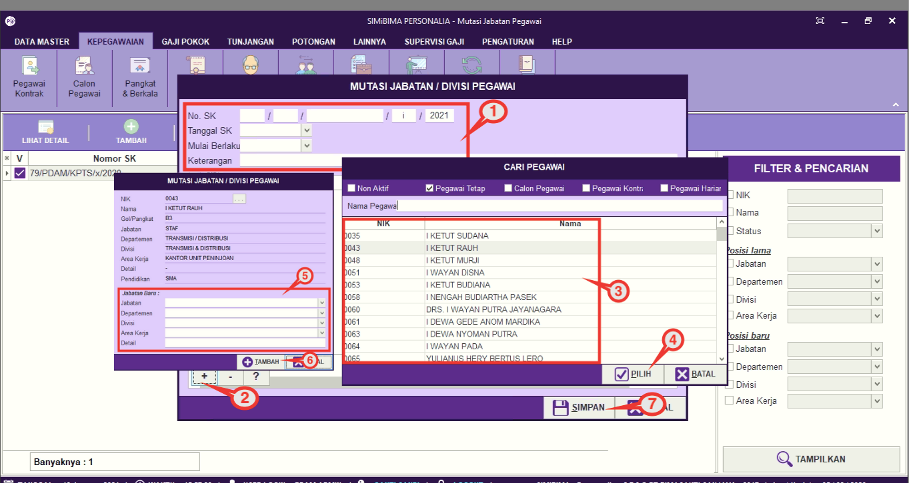
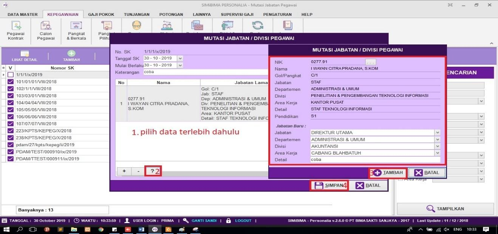
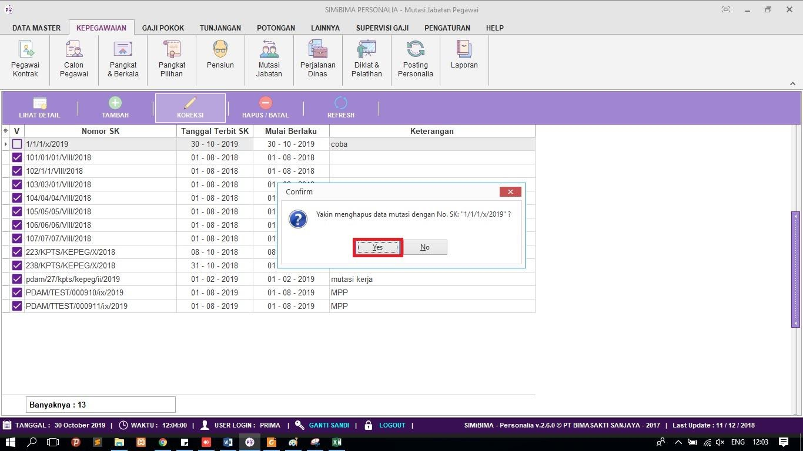

= Mengatur Pencatatan Data Mutasi Pegawai

Fitur ini berfungsi untuk mengatur pencatatan mutasi pegawai, baik itu menambahkan, memperbarui maupun menghapus data. Berikut langkah yang bisa diikuti untuk menggunakannya.

== Melihat Data Mutasi Jabatan
1. Pilih menu *Kepegawaian*
2. Cari ikon *Mutasi Jabatan*
3. Untuk melihat secara lebih detail data mutasi pegawai, Pilih data pegawai yang ingin dilihat, selanjutnya klik pada ikon *Lihat Detail* seperti poin 3 pada gambar di atas. Jika sudah maka akan muncul form informasi secara detail, seperti gambar di bawah ini.
+

== Menambahkan Mutasi Jabatan Baru

1. Untuk menambahkan mutasi jabatan baru, klik pada ikon *Tambah* seperti poin 4 pada gambar utama di atas. 
2. Selanjutnya isi form mutasi jabatan, seperti No. SK, Tanggal SK, Mulai Berlaku, dan Keterangan
3. Cari tombol + seperti poin 2 pada gambar di bawah
4. Pilih pegawai yang akan dimutasi, jika sudah klik tombol *Pilih* seperti poin 4 pada gambar di bawah
5. Lengkapi, form jabatan baru. Jika sudah klik tombol *Tambah* seperti poin 5 dan 6 pada gambar di bawah
6. Jika semua data pegawai sudah dimasukkan, klik tombol *Simpan* seperti poin 7 pada gambar di bawah.
+

== Memperbarui Data Mutasi 
1. Untuk memperbarui data, pilih data yang ingin diubah terlebih dahulu
2. Selanjutnya klik pada ikon *Koreksi* seperti poin 5 pada gambar utama di atas
3. Pilih data pegawai yang ingin diperbarui, seperti poin 1 pada gambar di bawah ini
4. Cari ikon (*?*) yang berfungsi untuk memperbarui data
5. Perbarui bagian yang ingin diubah. Jika sudah, klik tombol *Simpan* seperti poin 3 pada gambar di bawah ini
6. Jika data sudah diperbarui, klik pada tombol *Simpan* untuk menyimpan data yang sudah diubah.
+

== Menghapus Data Mutasi
1. Untuk menghapus data, pilih data yang ingin dihapus terlebih dahulu. Selanjutnya klik pada ikon *Hapus* seperti poin 5 pada gambar utama di atas. Setelah itu terdapat form konfirmasi, jika sudah yakin untuk menghapus data wilayah, klik tombol *Yes* seperti gambar di bawah ini.
+
