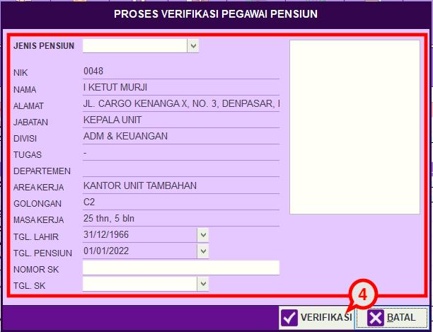

= Mengatur Pencatatan Data Pegawai Pensiun

Fitur ini berfungsi untuk mengatur pencatatan pensiun, User dapat melihat data pegawai dan memilih pegawai yang akan dinyatakan pensiun. Berikut langkah yang bisa diikuti untuk menggunakannya.

1. Pilih menu *Kepegawaian*
2. Cari ikon *Pensiun*
3. Klik kanan mouse pada data pegawai yang akan dinyatakan pensiun
+

4. Lengkapi proses verifikasi pegawai pensiun, seperti Jenis Pensiun, No. SK, dan Tanggal SK. Jika sudah User dapat mengklik tombol *Verifikasi* seperti gambar di atas.