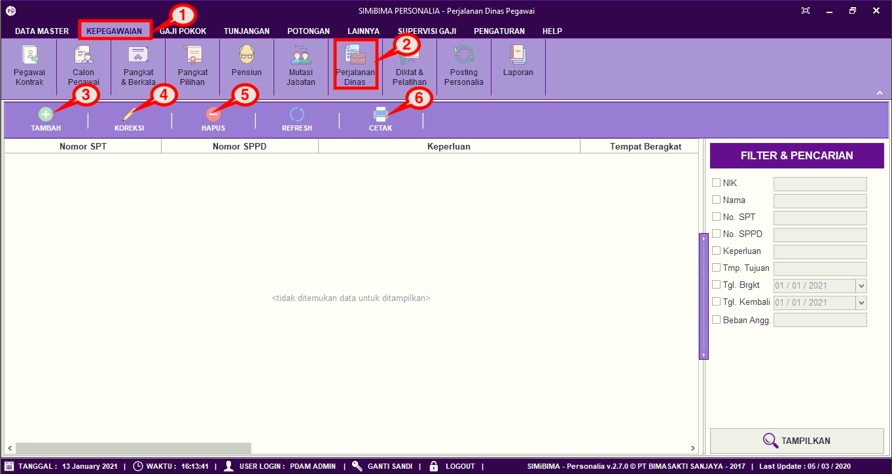
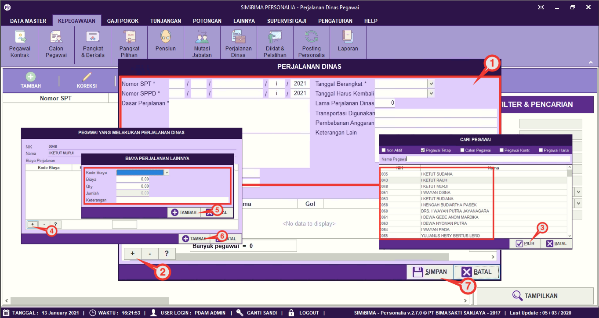
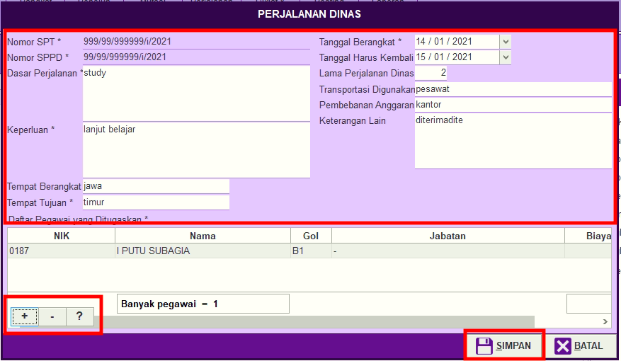
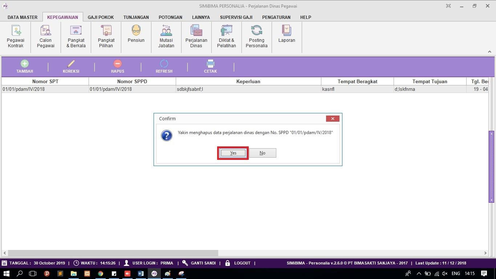

= Mengatur Pencatatan Data Perjalanan Dinas

Fitur ini berfungsi untuk mengatur pencatatan perjalanan dinas, baik itu menambahkan, memperbarui maupun menghapus data. Berikut langkah yang bisa diikuti untuk menggunakannya.

== Menambahkan Daftar Perjalanan Dinas
1. Pilih menu *Kepegawaian* seperti poin 1 pada gambar di atas
2. Cari ikon *Perjalanan Dinas* seperti poin 2 pada gambar di atas
3. Untuk menambahkan daftar perjalanan dinas, klik pada ikon *Tambah* seperti poin 3 pada gambar utama di atas
4. Selanjutnya isi form perjalanan dinas, seperti poin 1 pada gambar di bawah
5. Cari tombol (*+*) untuk melihat seluruh daftar pegawai, seperti poin 2 pada gambar di bawah
6. Pilih pegawai yang akan melakukan perjalanan dinas. Jika sudah klik pada tombol *Pilih* seperti poin 3 pada gambar di bawah
7. Cari ikon (*+*) untuk memunculkan form input untuk biaya perjalanan, seperti poin 4 pada gambar di bawah
8. Isi biaya yang akan dikeluarkan untuk perjalanan dinas tersebut. Untuk menyimpan data biaya perjalanan yang sudah diisi, klik tombol *Simpan* seperti poin 5 pada gambar di bawah
9. Jika semua biaya sudah dilengkapi, klik tombol *Tambah* seperti poin 6 pada gambar di bawah
10. Jika semua data, baik data pegawai, biaya tujuan perjalan dinas sudah diisi, klik tombol *Simpan* untuk mencatat perjalan dinas tersebut seperti poin 7 gambar di bawah ini.
+

== Memperbarui Data
1. Untuk memperbarui data, pilih data yang ingin diubah terlebih dahulu. Selanjutnya klik pada ikon *Koreksi* seperti poin 4 pada gambar utama di atas. Untuk menambah pegawai dalam daftar diklat klik pada tombol (*+*), jika ingin mengurangi klik pada tombol (*-*). Jika ingin mengubah biaya perjalanan dinas klik pada tombol (*?*). Perbarui bagian yang ingin diubah. Jika sudah klik pada tombol *Simpan*, seperti gambar di bawah ini.
+

2. Untuk menghapus data, pilih data perjalanan dinas yang ingin dihapus terlebih dahulu. Selanjutnya klik pada ikon *Hapus* seperti poin 5 pada gambar utama di atas. Setelah itu terdapat form konfirmasi, jika yakin untuk menghapus data tersebut, klik tombol *Yes*. Seperti pada gambar di bawah ini
+

3. Untuk mencetak laporan perjalanan dinas, Pilih data perjalanan dinas yang ingin dicetak, selanjutnya klik pada ikon *Cetak*, seperti poin 6 pada gambar utama di atas. 