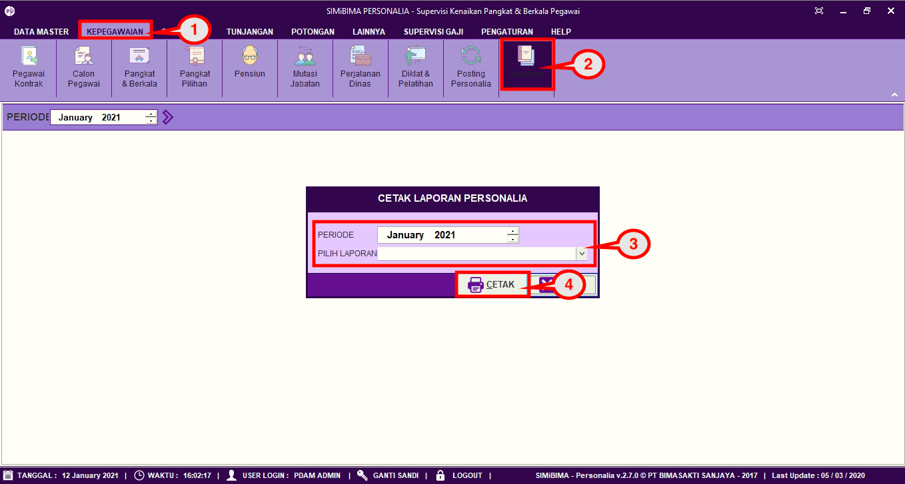

= Mengatur Periode dan Jenis Laporan

Fitur ini berfungsi untuk mengatur periode dan jenis laporan, baik itu menambahkan, memperbarui, dan menghapus jenis divisi. Berikut langkah yang bisa diikuti untuk menggunakannya.

1. Pilih menu *Kepegawaian*
2. Cari ikon *Laporan*
3. Pilih periode dan jenis laporan yang ingin ditampilkan
4. Jika sudah, klik tombol *Cetak* untuk menampilkan data tersebut.
