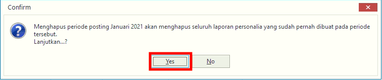

= Mengatur dan Memposting Data Personalia

Fitur ini digunakan untuk mengolah data personalia baik untuk posting maupun menghapus. Berikut langkah yang bisa diikuti untuk menggunakannya.

1. Pilih menu *Kepegawaian*
2. Cari ikon *Posting Personalia*
3. Pilih ikon *Posting*. Lalu pilih periode yang akan diunggah setelah itu  klik tombol *POSTING*
+

4. Pilih ikon *Hapus*. Lalu klik pada tombol *Yes*.
+
