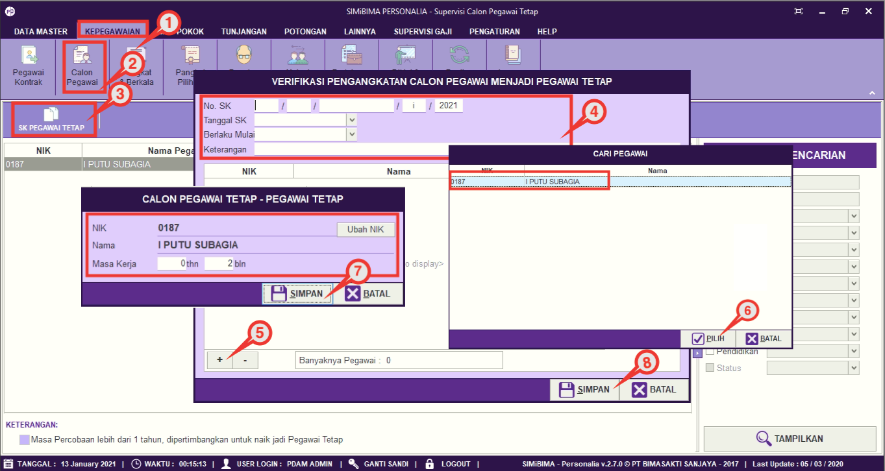

= Mengubah Data Calon Pegawai menjadi Pegawai Tetap

Fitur ini berfungsi untuk mengatur pengangkatan Calon Pegawai (Pegawai 80%) menjadi pegawai tetap. Berikut langkah yang bisa diikuti untuk menggunakannya.

1. Pilih menu *Kepegawaian*
2. Selanjutnya cari ikon *Calon Pegawai*
3. Pilih SK Pegawai Tetap
4. Masukkan No. SK, Tanggal SK, dan Tanggal Berlaku dan keterangan
5. klik pada tombol (*+*) untuk melihat daftar pegawai kontrak
6. Pilih pegawai yang akan diangkat sebagai pegawai tetap, jika sudah klik pada tombol *Pilih*
7. Masukkan masa kerja, selanjutnya klik pada tombol *Simpan*
8. Jika data sudah terisi dengan benar, klik tombol *Simpan*.
