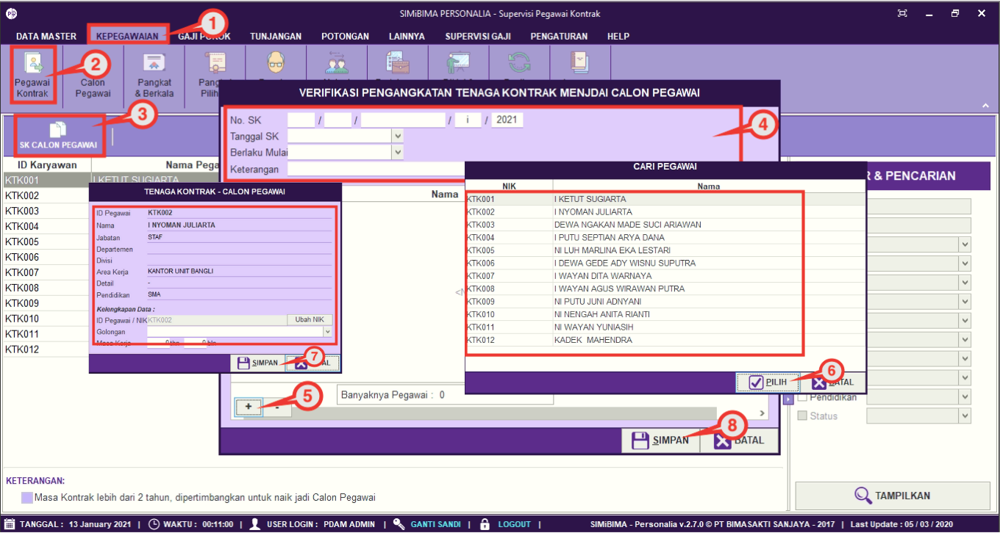

= Mengubah Data Pegawai Kontrak Menjadi Calon Pegawai

Fitur ini berfungsi untuk mengatur pengangkatan Pegawai Kontrak menjadi Calon Pegawai (Pegawai 80%). Berikut langkah yang bisa diikuti untuk menggunakannya.

1. Pilih menu *Kepegawaian*
2. Selanjutnya cari ikon *Pegawai Kontrak*
3. Pilih SK calon pegawai
4. Masukkan No. SK, Tanggal SK, dan Tanggal berlaku dan keterangan
5. Klik pada tombol (*+*) untuk melihat daftar pegawai kontrak
6. Pilih pegawai kontrak yang akan diangkat sebagai calon pegawai
7. Masukkan NIK, golongan, dan masa kerja. Lalu, klik pada tombol *Simpan*
8. Jika data sudah terisi dengan benar, klik tombol *Simpan*.