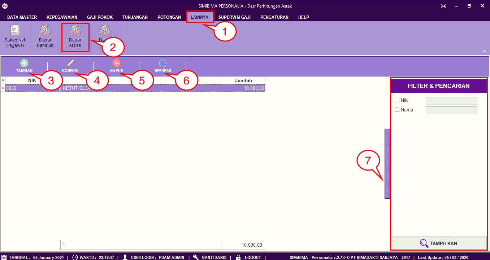
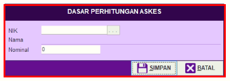
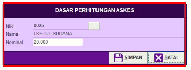
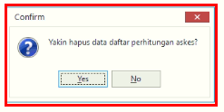

= Menambah Memperbarui dan Menghapus Data Askes

Fitur ini *Dasar Akses* berfungsi untuk dasar perhitungan potongan. Misalnya, potongan BPJS ambil dasarnya dari menu *Dasar Askes*. Berikut langkah-langkah dan penjelasan menu *Dasar Askes*.

1. Pilih menu *Lainnya*
2. Selanjutnya cari ikon *Dasar Askes*
3. Untuk menambahkan data *Dasar Akses*, klik pada tombol *Tambah* seperti poin . Selanjutnya lengkapi data pada form. Jika sudah User dapat mengklik tombol *Simpan* seperti pada gambar
+

4. Untuk memperbarui data, pilih data yang ingin User perbarui terlebih dahulu. Selanjutnya klik pada ikon *Koreksi*. Selanjutnya perbarui bagian yang ingin diubah, jika sudah User dapat mengklik tombol *Simpan*
+

5. Untuk menghapus data, pilih data yang ingin User hapus terlebih dahulu. Selanjutnya klik pada tombol *Hapus*. Centang data yang ingin dihapus, jika User yakin untuk menghapus data *Dasar Askes*, User dapat mengklik tombol *Hapus*
+

6. Ikon *Refresh* digunakan untuk refresh pada data Askes bulanan ketika ada data yang belum muncul setelah ditambahkan data baru
7. Ikon *Pencarian* digunakan untuk mencari data pada Dasar Askes berdasarkan field yang sudah ditentukan yaitu *NIK* dan *Nama*. Klik tombol *Tampilkan* untuk menampilkan tunjangan yang akan dicari sesuai dengan field yang sudah diisi.