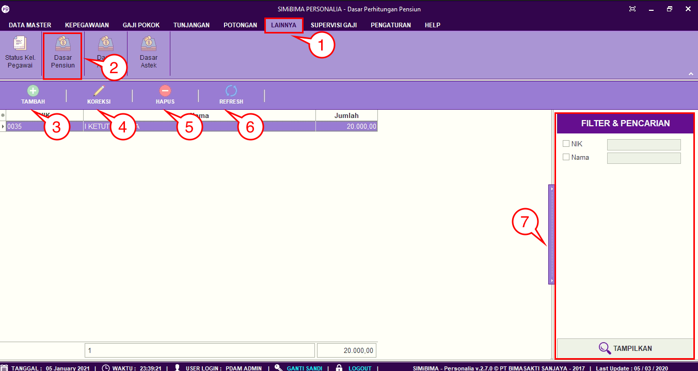
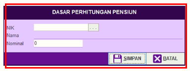
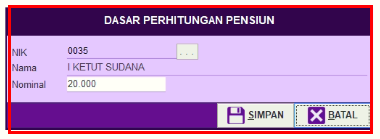
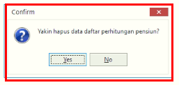

= Menambah Memperbarui dan Menghapus Data Pensiun

Fitur ini *Dasar Pensiun* berfungsi untuk dasar perhitungan potongan gaji yang akan diaplikasikan ke data di menu *Dasar Pensiun*.  Berikut langkah-langkah dan penjelasannya.

1. Pilih menu *Lainnya*
2. Selanjutnya cari ikon *Dasar Pensiun*
3. Untuk menambahkan data Dasar Pensiun, klik pada tombol *Tambah* seperti poin. Selanjutnya lengkapi data pada form. Jika sudah klik tombol *Simpan* seperti pada gambar
+

4. Untuk memperbarui data, pilih data yang ingin diperbarui terlebih dahulu. Selanjutnya klik pada ikon *Koreksi* seperti poin 7 pada gambar utama di atas. Selanjutnya perbarui bagian yang ingin diubah, jika sudah klik tombol *Simpan*
+

5. Untuk menghapus data, pilih data yang ingin dihapus terlebih dahulu. Selanjutnya klik pada tombol *Hapus*. Centang data yang ingin dihapus, jika yakin untuk menghapus data tunjangan, klik tombol *Hapus*
+

6. Ikon *Refresh* digunakan untuk refresh pada data Pensiun bulanan ketika ada data yang belum muncul setelah ditambahkan data baru.
7. Ikon *Pencarian* digunakan untuk mencari data pada *Dasar Pensiun* berdasarkan field yang sudah ditentukan yaitu *NIK* dan *Nama*. Klik tombol *Tampilkan* untuk menampilkan tunjangan yang akan dicari sesuai dengan field yang sudah diisi.