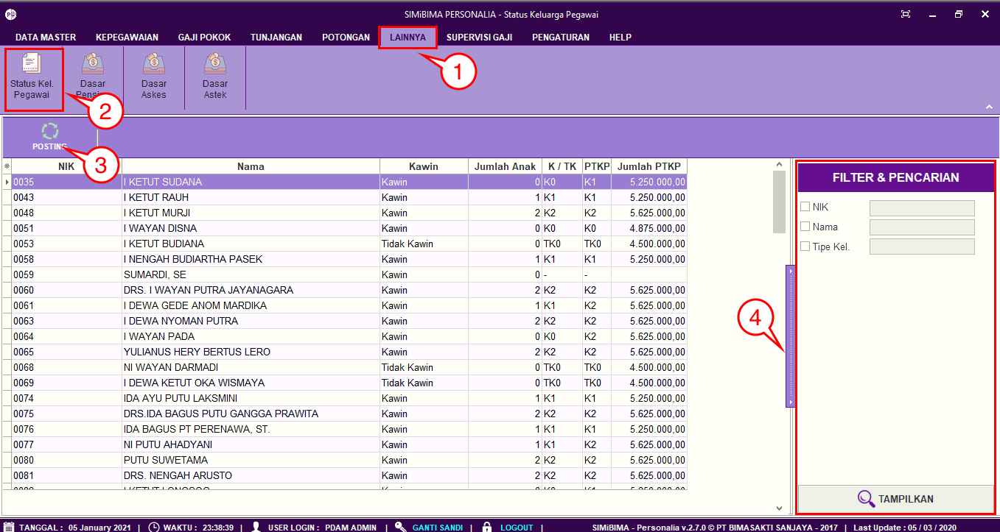

= Posting dan Mencari Data Status Keluarga

Fitur *Status Keluarga Pegawai* berfungsi untuk melakukan posting dari data input yang sebelumnya dilakukan di menu *Data Master > Data Keluarga*. Berikut langkah-langkah dan penjelasan menu *Status Keluarga Pegawai*.

1. Pilih menu *Lainnya*
2. Selanjutnya cari ikon *Status Kel. Pegawai*
3. Klik *Posting* digunakan untuk menampilkan data Status Keluarga Pegawai yang sudah ditambahkan
4. Fitur *Pencarian* digunakan untuk mencari data pada *Status Keluarga Pegawai* berdasarkan field yang sudah ditentukan yaitu *NIK, Nama* dan *Tipe Kel*. Klik tombol *Tampilkan* untuk menampilkan tunjangan yang akan dicari sesuai dengan field yang sudah diisi.