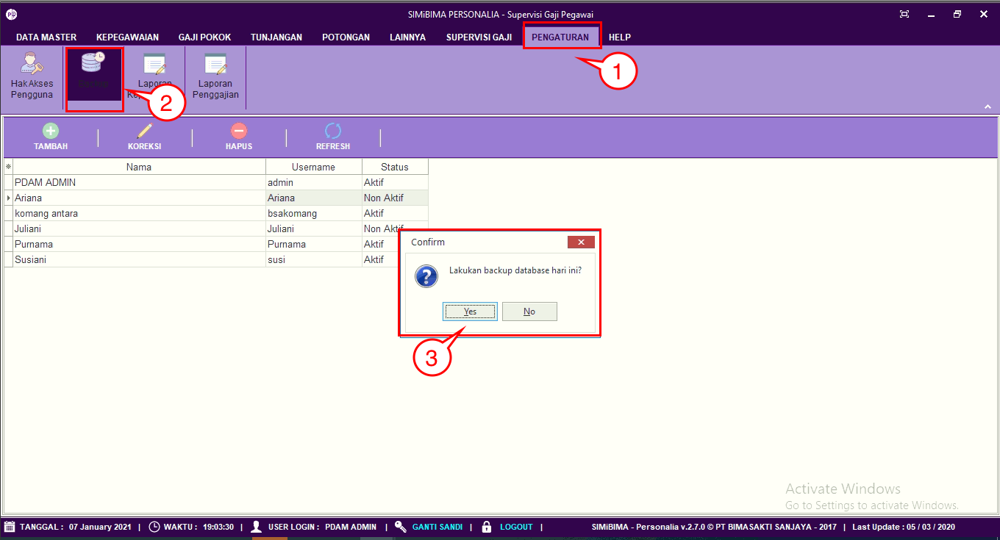

= Mencadangkan Database

Fitur ini berfungsi untuk mencadangkan data. Berikut langkah-langkahnya:

1. Pilih menu *Pengaturan*
2. Cari ikon *Backup*
3. klik pada tombol *Yes* jika User ingin melakukan backup database, seperti pada gambar di atas.