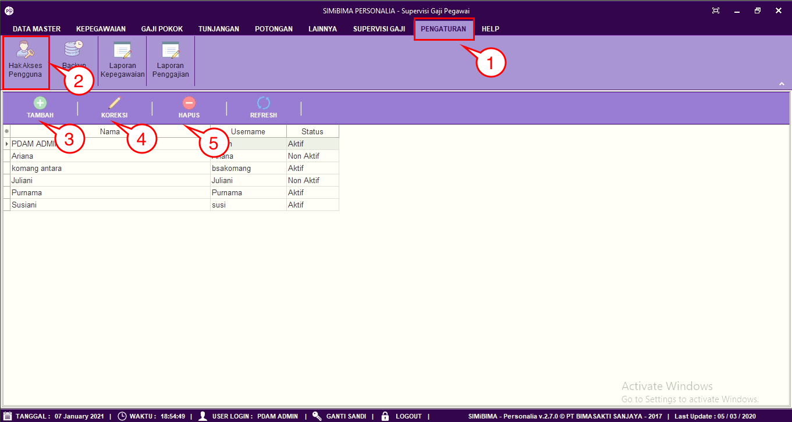
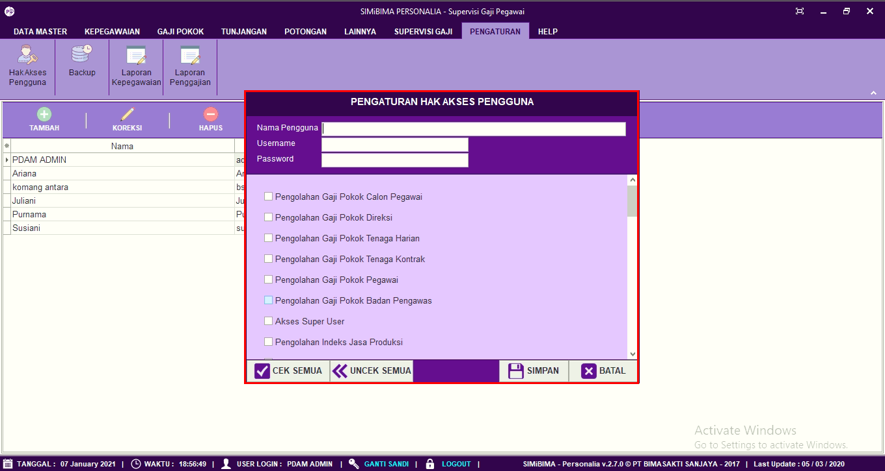
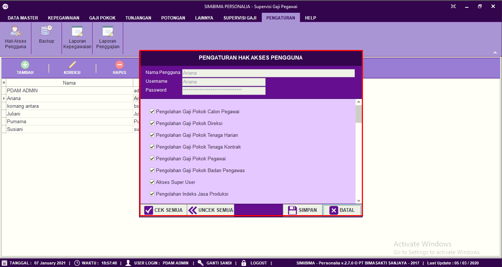

= Mengatur Memperbarui Menambah dan Menghapus Hak Akses Pengguna

Fitur ini berfungsi untuk mengatur hak akses dalam penggunaan sistem, baik itu menambahkan hak akses, memperbarui, dan menghapus data. Berikut langkah-langkahnya.

1. Pilih menu *Pengaturan*
2. Cari ikon Hak *Akses Pengguna*
+

3. Untuk menambahkan hak akses pengguna klik pada tombol *Tambah* seperti poin 3 pada gambar di atas. Selanjutnya lengkapi data seperti nama pengguna, username, password dan akses fitur yang diperbolehkan. Jika sudah User dapat mengklik tombol *Simpan*. 
4. Untuk memperbarui data, pilih data yang ingin User perbarui terlebih dahulu. Selanjutnya klik pada ikon *Koreksi*. Setelah itu perbarui bagian yang ingin User ubah, jika sudah User dapat mengklik tombol *Simpan*. 
+

5. Untuk menghapus data, pilih data yang ingin User hapus terlebih dahulu. Selanjutnya klik pada ikon *Hapus*. Selanjutnya terdapat _form_ konfirmasi, jika User yakin untuk menghapus hak akses aplikasi klik pada tombol *Yes*.