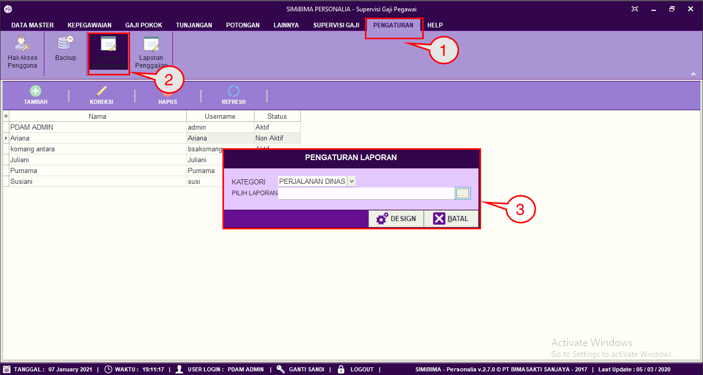
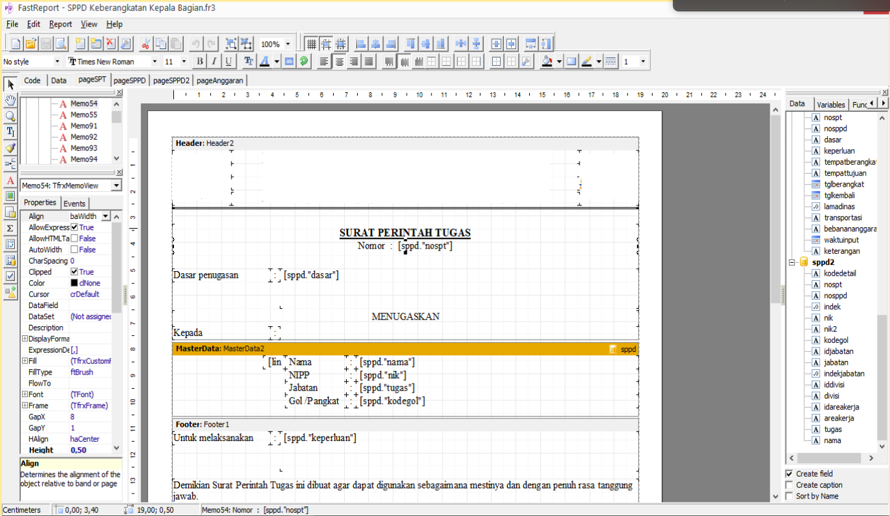

= Mengatur Tampilan Laporan Kepegawaian

Fitur ini berfungsi untuk mengatur tampilan (desain) laporan kepegawaian. Berikut langkah-langkahnya:

1. Pilih menu *Pengaturan*
2. Selanjutnya cari ikon *Laporan Kepegawaian*
3. Pilih kategori dan laporan yang ingin User ubah tampilannya kemudian jika sudah klik pada tombol *Design*. Berikut contoh halaman desain laporan:
+
