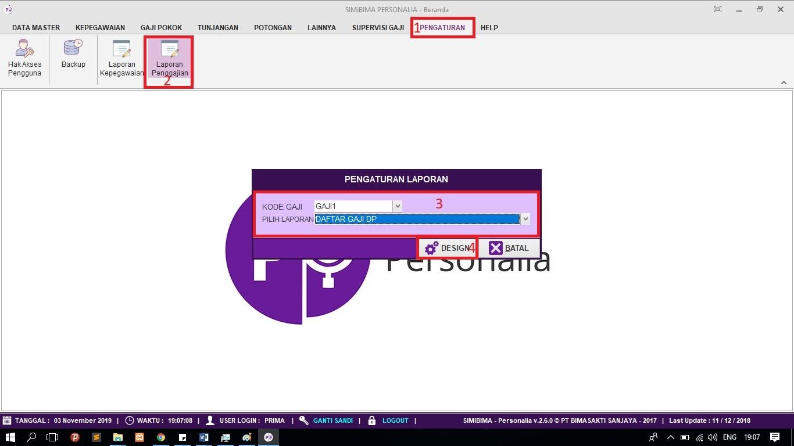
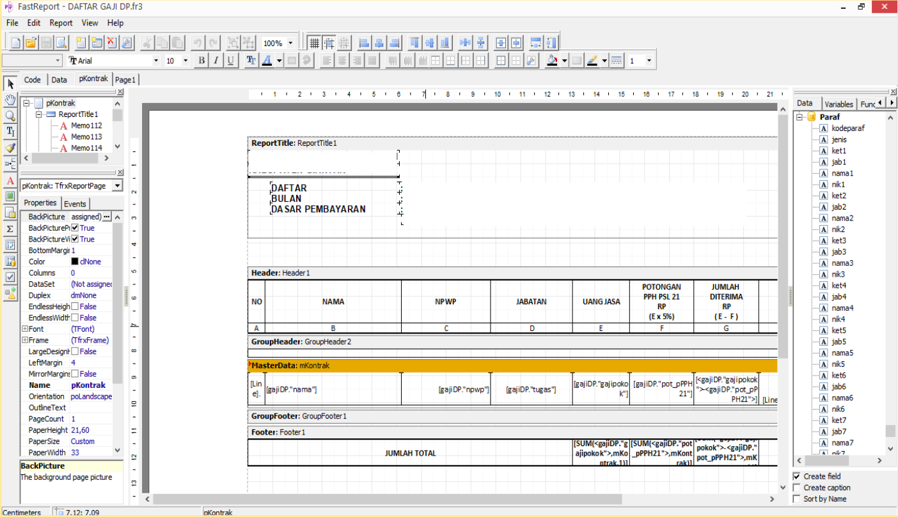

= Mengatur Tampilan Laporan Penggajian

Fitur ini berfungsi untuk mengatur tampilan (desain) laporan penggajian. Berikut langkah yang bisa diikuti untuk menggunakannya.

1. Pilih menu *Pengaturan*
2. Selanjutnya cari ikon *Laporan Penggajian*
3. Pilih kategori dan laporan yang ingin diubah tampilannya
4. Jika sudah, klik pada tombol *Design*. Berikut contoh halaman desain laporan.
+
