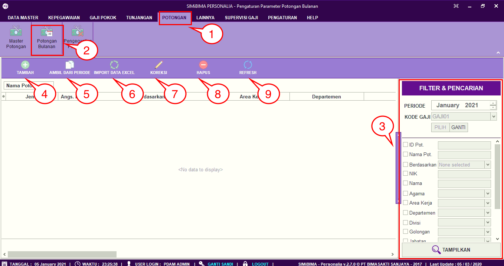
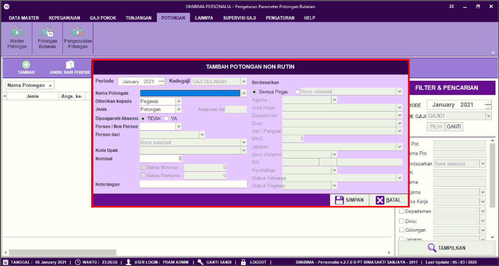
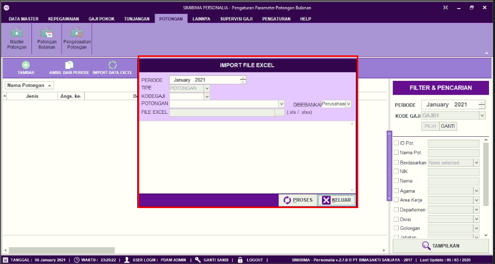

= Menambah Memperbarui dan Menghapus Data Jenis Potongan

Fitur ini berfungsi untuk mengatur jenis potongan, baik itu menambahkan, memperbarui, dan menghapus data jenis potongan, berikut langkah-langkahnya.

1. Pilih menu *Potongan*
2. Cari ikon *Master Potongan*
3. Untuk menambahkan jenis potongan, klik pada tombol *Tambah* seperti poin 3 pada gambar di atas. Selanjutnya lengkapi jenis potongan. Jika sudah klik tombol *Simpan* seperti pada gambar
+

4. Untuk memperbarui data, pilih data yang ingin diperbarui terlebih dahulu. Selanjutnya klik pada ikon *Koreksi* lalu perbarui bagian yang ingin diubah. Jika sudah klik tombol *Simpan* 
5. Untuk menghapus data, pilih data yang ingin dihapus terlebih dahulu. Selanjutnya klik pada ikon *Hapus* akan muncul pop up konfirmasi. Jika yakin untuk menghapus data jenis potongan, klik tombol *Yes* seperti pada gambar
+

6. Ikon *Refresh* digunakan untuk menyegarkan halaman berisi data *Master Potongan* ketika ada data yang belum muncul setelah ditambahkan
7. Ikon *Pencarian* digunakan untuk mencari data pada *Master Potongan* berdasarkan field yang sudah ditentukan yaitu *ID Potongan, Nama Potongan* dan *Tipe Potongan*. Klik tombol *Tampilkan* untuk menampilkan tunjangan yang akan dicari sesuai dengan field yang sudah diisi.