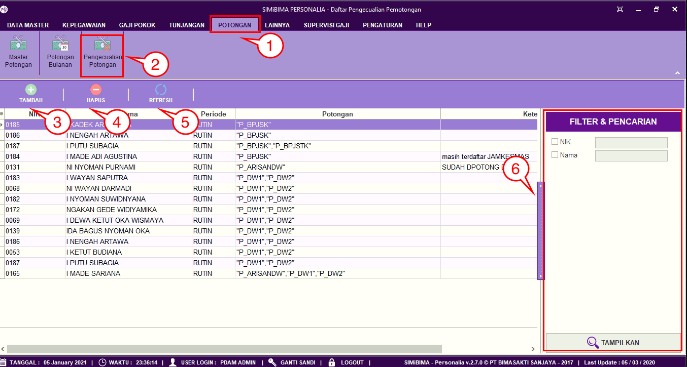
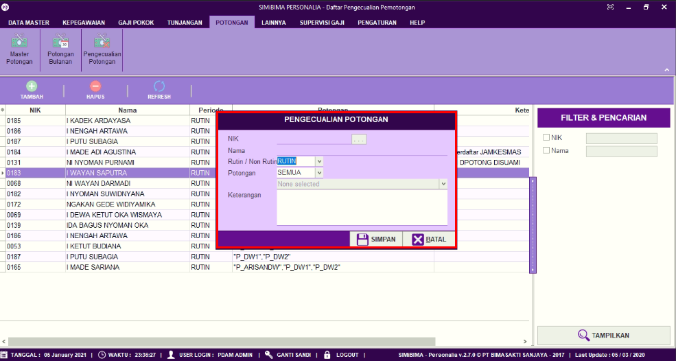
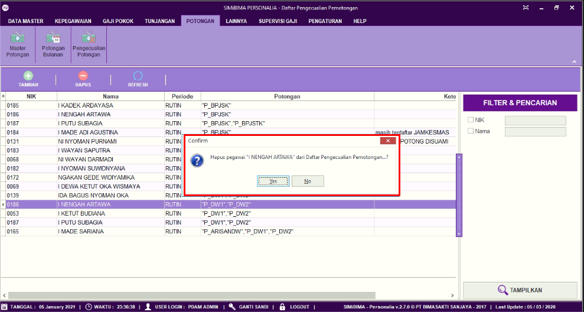

= Menambah Mengubah dan Menghapus Data Pengecualian Potongan

Fitur ini berfungsi untuk mengatur pengecualian hak tunjangan, seperti menambahkan maupun menghapus, berikut langkah-langkahnya.

1. Pilih menu *Potongan*
2. Cari ikon *Pengecualian Potongan*
3. Untuk menambah daftar pengecualian potongan, User dapat mengklik tombol *Tambah* seperti poin 3 pada gambar di atas. Selanjutnya lengkapi data pada form, seperti NIK pegawai, periode pemotongan rutin/tidak, kategori pemotongan, dan alasan pemotongan. Jika sudah klik tombol *Simpan*
+

4. Untuk menghapus data pengecualian potongan, pilih data pegawai yang ingin User hapus. Jika sudah, klik tombol *Hapus*, seperti poin 4 pada gambar utama di atas. Selanjutnya akan muncul pop up konfirmasi, jika yakin untuk menghapus data pegawai yang termasuk ke dalam pengecualian potongan maka klik tombol *Yes*
+

5. Ikon *Refresh* digunakan untuk menyegarkan halaman yang berisi data *Panengecuali Potongan* ketika ada data sudah ditambahkan belum muncul 
Ikon *Pencarian* digunakan untuk mencari data pada Pengecualian Potongan berdasarkan field yang sudah ditentukan yaitu *NIK* dan *Nama*. Klik tombol *Tampilkan* untuk menampilkan tunjangan yang akan dicari sesuai dengan field yang sudah diisi.
