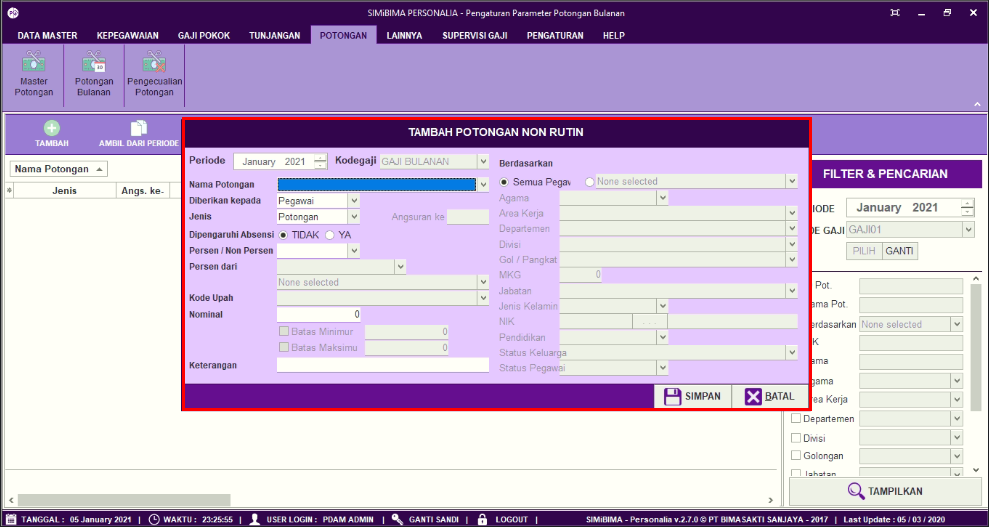
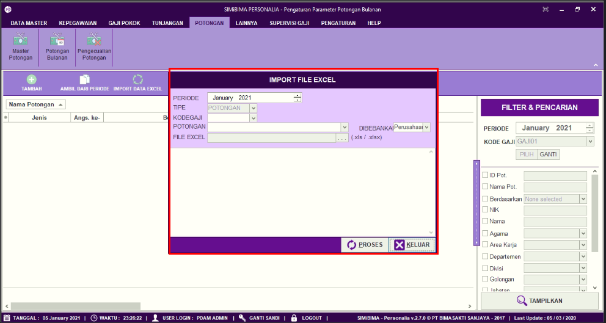

= Mengatur Potongan Bulanan

Fitur ini berfungsi untuk mengatur potongan bulanan, baik itu menambahkan, mengambil data potongan dari periode sebelumnya, import data Excel, memperbarui, dan menghapus data, berikut langkah-langkahnya.

image::../images-personalia/personalia-mengatur-potongan.png[align="center"]

1. Pilih menu *Potongan*
2. Cari ikon *Master Potongan*
3. Pilih *Periode* seperti poin 3 pada gambar di atas, pada menu filter pencarian berfungsi untuk mencari data potongan bulanan sesuai dengan field yang ditentukan. Setelah mengisi field, klik tombol *Tampilkan* untuk menampilkan data yang dicari
+

4. Untuk menambahkan potongan, klik pada tombol *Tambah* seperti poin 4 pada gambar di atas. Selanjutnya lengkapi form potongan, seperti penerima potongan, jenis potongan yang dikenakan, dll. Jika sudah klik tombol *Simpan* 
5. Selain dapat menambahkan potongan, User juga dapat untuk menggunakan potongan pada periode sebelumnya yang telah pernah dibuat dengan mengklik tombol *Ambil Dari Periode*. Selanjutnya lengkapi form, seperti salinan periode yang digunakan, kode gaji, dan jenis potongan yang dikenakan. Jika sudah klik pada tombol *Proses*. Kemudian klik *Yes* untuk menampilkan data 
6. Selain dapat menambahkan data potongan manual dan satu persatu. Penambah data juga bisa dilakukan dengan cara import dari file excel dengan cara klik tombol *Import Data Excel*. Kemudian pilih file excel. Klik *Proses* untuk menambahkan data
+

7. Untuk update data atau Koreksi bisa dilakukan dengan pilih data yang ada pada list Potongan kemudian klik tombol *Koreksi*. Lakukan update pada data yang dipilih. Kemudian klik tombol *Simpan* untuk menyimpan perubahan data
8. Untuk menghapus data bisa dilakukan dengan memilih data terlebih dahulu pada list Potongan kemudian klik tombol *Hapus*. Konfirmasi data yang akan dihapus, kemudian klik tombol *Hapus* untuk hapus data yang dipilih
+

9. Ikon *Refresh* digunakan untuk melakukan penyegaran terhadap data yang belum masuk ketika data baru berhasil ditambahkan.