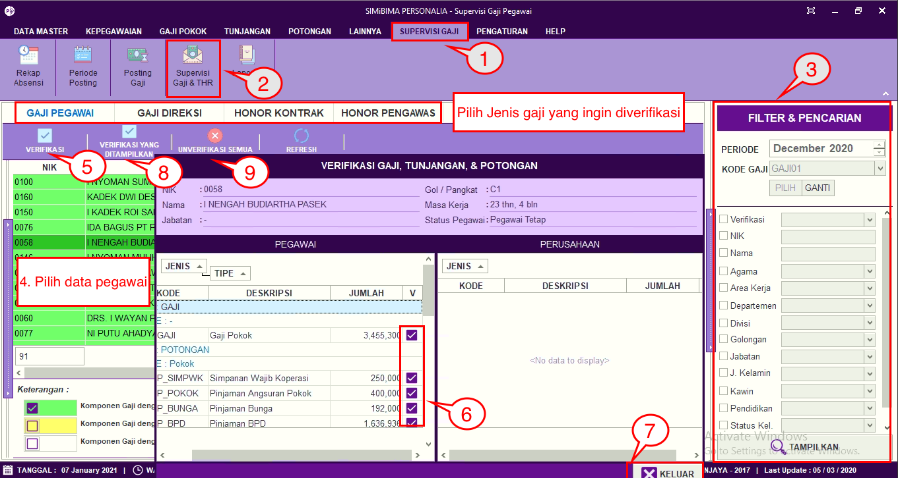

= Melakukan Verifikasi Gaji THR

Fitur ini berfungsi untuk melakukan verifikasi gaji dan THR (tunjangan hari raya) baik itu gaji pegawai, direksi, honorer kontrak, dan honorer pengawas. Berikut langkah-langkahnya:

1. Pilih menu *Supervisi Gaji*
2. Cari ikon *Supervisi Gaji & THR*
3. Pilih periode dan kode gaji yang ingin dilakukan proses verifikasi
4. Jika sudah, pilih data gaji pegawai yang akan diverifikasi
5. klik pada tombol *Verifikasi*
6. Berikan User centang jika data sudah benar
7. Setelah data terverifikasi, selanjutnya klik pada tombol *Keluar*
8. Namun, jika User ingin melakukan verifikasi pada data gaji karyawan sekaligus, User dapat mengklik tombol *Verifikasi Yang Ditampilkan*, seperti poin 8 pada gambar di atas
9. Untuk membatalkan data gaji yang telah terverifikasi, User dapat mengklik tombol *Unverifikasi Semua*. Seperti poin 9 pada gambar di atas.